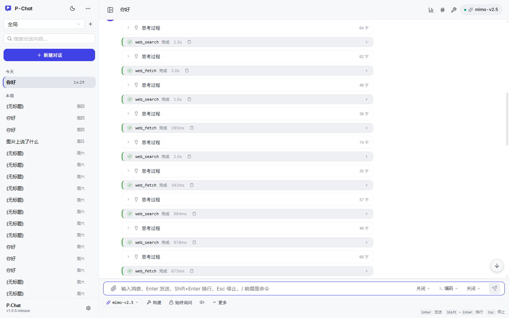
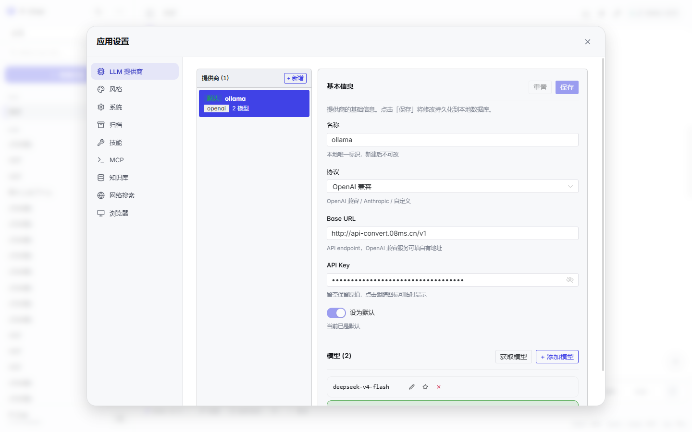
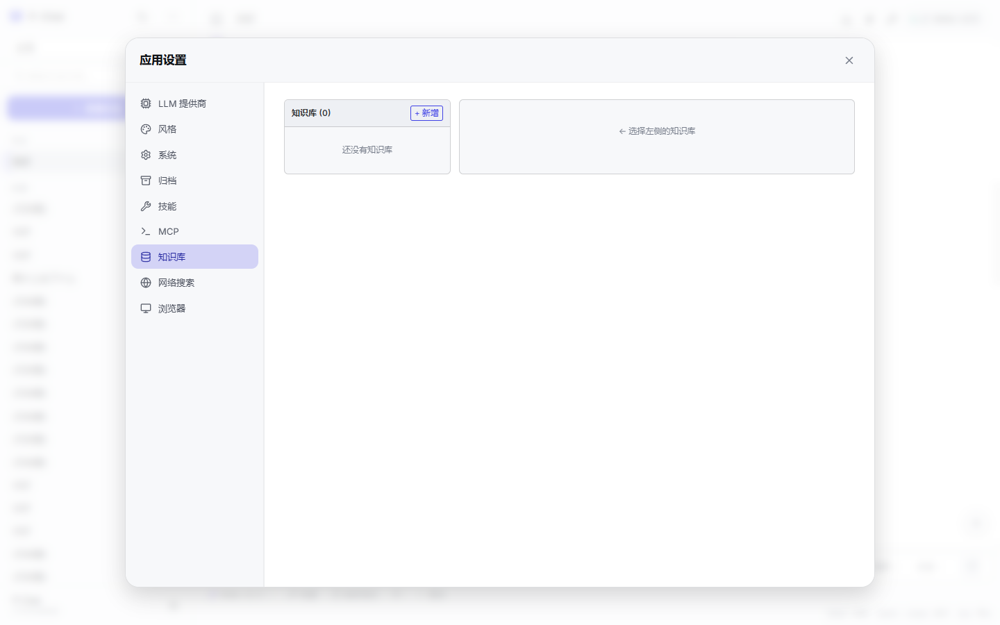
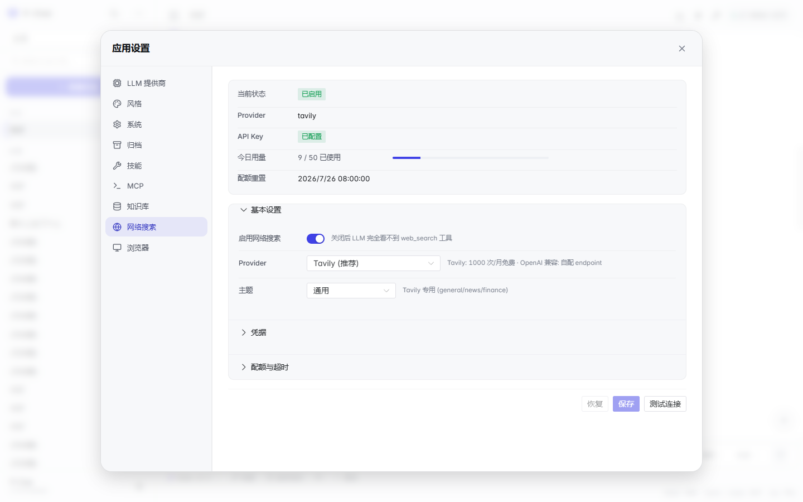

# P-Chat

本地优先的 LLM 对话 Agent。三个二进制共用同一份后端代码：

- `pchat.exe` — 终端 REPL
- `pchat-server.exe` — 独立 HTTP server（自带 web/ 前端）
- `pchat-gui.exe` — Wails 桌面应用，托管 server 子进程

支持 OpenAI 兼容协议（OpenAI / DeepSeek / Ollama / 通义千问 / 智谱 / 百川 等）和 Anthropic 原生协议（Claude）。三种内置人格（可爱 / 古风 / 科技），可加自定义。

关于作者：

- 小红书：<https://www.xiaohongshu.com/user/profile/65cadd28000000000b035e5f>
- 个人站：<http://www.08ms.cn>（**code dog 小站**）

---

## 当前进度快照

> 快照日期：2026-07-31。仓库 `VERSION` 当前为 `1.0.8-dev`；`CHANGELOG.md` 已记录到 v1.0.9 的开发项，正式分发版本以 `VERSION` 和 release tag 为准。

P-Chat 现在已经不是单纯的聊天壳，而是围绕本地 AI 编程助手形成了比较完整的桌面工作台：

| 模块 | 当前状态 | 说明 |
| --- | --- | --- |
| 三端形态 | 已落地 | CLI、独立 HTTP server、Wails 桌面端共用同一套 agent/server 逻辑 |
| 对话流 | 已落地 | text / thinking / tool / sub-agent parts 结构化渲染，支持 SSE 流式、seq、断线恢复 |
| Agent 执行 | 已落地 | ReAct 工具循环、并发工具派发、auto-continue、Plan/Build、todo 守卫、stuck-loop 保护 |
| LLM 协议 | 已落地 | OpenAI 兼容 + Anthropic 原生；自定义 SSE reader 兼容 reasoning / proxy error / 非标准 delta |
| 项目系统 | 已落地 | 多项目注册，项目级 `AGENTS.md` / rules / skills / tools 注入 |
| 知识库 | 已落地 | 本地 Wiki/FTS5、三层索引树、混合检索、查询分解、多库重排、增量扫描 |
| 工具体系 | 已落地 | 内置文件/命令/搜索/文档/问题/todo 工具；动态 YAML 工具支持全局与项目级加载 |
| 浏览器控制 | 已落地 | Chrome/Edge 扩展连接、真实页面导航/点击/输入/截图、多 tab 目标、域名权限策略 |
| 可观测性 | 已落地 | 端到端 trace id、上下文检查器、工具列表抽屉、动态工具加载诊断 |
| IM 桥接 | 骨架进行中 | `internal/im` 后端抽象、飞书部分入站/出站、Gateway/adapter 基础已在代码中；GUI 设置和完整入站 agent 流程仍需推进 |
| MCP 集成 | 基础可用 / 待增强 | 已有 MCP 管理模块和设置入口，工具协议、权限和诊断体验仍在 backlog |
| 沙箱增强 | 基础已落地 / 待增强 | 命令/写文件确认与浏览器域名策略已接入；Docker 隔离、策略可视化仍未完成 |
| 发布体验 | 已落地一部分 | Windows 安装器、Linux/macOS 打包脚本、浏览器扩展打包、版本注入已有；跨平台 GUI 构建仍受 Wails/宿主环境限制 |

更细的“已落地能力 + 后续可做事项”维护在 [`docs/feature-opportunities.md`](docs/feature-opportunities.md)。历史设计方案保留在 [`docs/plans/`](docs/plans/)。

### 下一步优先级

1. **动态工具安全收口**：补动态工具权限分级、禁用/回退机制。
2. **Agent 执行透明度**：展示 auto-continue 次数、继续原因、最终停止原因，增强子 agent 汇总。
3. **MCP 完整集成**：让 MCP 工具进入统一工具列表、确认、错误展示和 GUI 诊断。
4. **沙箱运行环境**：评估 Docker runner、跨平台路径/命令策略一致性。
5. **文档与发布**：新增 GUI 功能时同步 README FAQ、`.agents/docs/INDEX.md` 和 `docs/feature-opportunities.md`。

---

## 快速启动

### 方式 A — Windows 安装包（推荐新用户）

1. 从 [Releases](../../releases) 下载 `pchat-setup.exe`
2. 双击运行，弹出目录选择框，选择或者创建pchat目录
3. 安装程序会解压 `pchat-gui.exe` / `pchat-server.exe` / `pchat.exe` + `web/`，写入开始菜单和桌面快捷方式
4. 从开始菜单启动 **P-Chat**

首次启动时 GUI 会自动拉起 server 子进程，关窗自动结束子进程，不需要手动管理。

### 方式 B — CLI 启动

从安装目录或 release 压缩包直接执行 `pchat.exe`：

```powershell
# 终端 REPL，科技风（默认）
pchat.exe

# 可爱风 / 古风
pchat.exe --style cute
pchat.exe --style guofeng

# 指定提供商
pchat.exe --provider deepseek

# 指定配置文件
pchat.exe --config D:\my-project\config.yaml

# 直接进 REPL，不启动 server 子进程（只读命令）
pchat.exe skills
pchat.exe rules
pchat.exe config
pchat.exe version
```

`pchat.exe` 启动时会自动拉起同目录的 `pchat-server.exe`，所有对话走 server 的 SSE 端点，和 GUI 走同一条代码路径。Ctrl+C 退出，server 子进程一并结束。

### 方式 C — 浏览器模式

只跑 server，自带 web 前端：

```powershell
pchat-server.exe
# 浏览器打开 http://127.0.0.1:15150/app/index.html
```

端口和 host 走 `~/.p-chat/config.json` 的 `server` 段。

### 方式 D — 从源码构建

```powershell
# 依赖：Go 1.21.13 / Node 24.11 / Wails v2.12
task build:all      # pchat.exe + pchat-server.exe + 前端
task build:gui      # 额外：pchat-gui.exe
task package:gui    # 完整 bundle（含 web/）
```

Windows installer 由 `cmd/pchat-installer/main.go` 编译产出，资源在 `cmd/pchat-installer/assets/`，打包脚本在 `scripts/build-installer.ps1`。

#### 开发模式（dev-bin/）

日常开发不用 `task package:gui` 整套打包，用 `task build:dev` 编译到仓库根的 `dev-bin/` 目录，然后直接跑：

```powershell
task build:dev
# 等价于：
#   1. 编译 frontend（dist/）
#   2. go build → dev-bin/pchat-server.exe
#   3. go build → dev-bin/pchat.exe
#   4. wails build-debug → dev-bin/pchat-gui.exe
#   5. 杀掉旧进程，启动新的 dev-bin/pchat-gui.exe
```

`dev-bin/` 这个路径名是固定的 — 二进制启动时按 `internal/paths/devhome.go` 的策略解析数据目录：

```
优先级：PCHAT_DATA_HOME 环境变量 > dev-bin/.p-chat/ > $HOME/.p-chat/
```

也就是说跑 `dev-bin/pchat-gui.exe` 时，配置 / 会话 / 技能 / 知识库全都落在 `dev-bin/.p-chat/` 下，跟 `task build:gui` 装到 `%LOCALAPPDATA%` 用的 `$HOME/.p-chat/` 是**隔离的两份**。改源码、删 dev-bin 重跑都不会污染生产数据。改 `dev-bin/.p-chat/config.json` 也不影响安装版。

源码改完只要再 `task build:dev` 一次就会原地热替换。

### 前置

不管用哪种方式，首次启动后第一件事是 **配置 LLM Provider**。在 GUI 打开「应用设置」→「LLM 提供商」，至少添加一个 provider 并填好 API key，否则 server 启起来后所有对话都会回 `E_DISABLED`。

---

## 安装包流程

### 安装包组成

| 路径 | 来源 | 说明 |
| --- | --- | --- |
| `cmd/pchat-installer/main.go` | 入口 | Go 写的安装引导，弹目录选择框、调用 `install.ps1` |
| `cmd/pchat-installer/assets/install.ps1` | 安装脚本 | 创建快捷方式、写入注册表、设置 `PCHAT_HOME` |
| `cmd/pchat-installer/assets/uninstall.ps1` | 卸载脚本 | 反向操作 |
| `cmd/pchat-installer/assets/pchat-gui.exe` | 待分发 | Wails 桌面端 |
| `cmd/pchat-installer/assets/pchat-server.exe` | 待分发 | HTTP server |
| `cmd/pchat-installer/assets/pchat.exe` | 待分发 | CLI |
| `cmd/pchat-installer/assets/web/` | 前端 | 由 `scripts/sync-web.ps1` 从 `frontend/dist/` 同步 |

setup.exe 把上面 5 项（`install.ps1` + 3 个二进制 + `web/`）打进 `//go:embed` 资源里，安装时统一解压。

### 安装流程

```
setup.exe
  └─ 创建临时目录
     └─ 解压 assets/*
        └─ 弹出 FolderBrowserDialog 选安装目录
           └─ 执行 install.ps1 -InstallDir <选中的目录> -AddToPath
              ├─ 复制 3 个二进制 + web/ 到目标目录
              ├─ 创建开始菜单快捷方式（P-Chat.lnk → pchat-gui.exe）
              ├─ 创建桌面快捷方式
              ├─ 写注册表卸载项（HKCU\Software\Microsoft\Windows\CurrentVersion\Uninstall\P-Chat）
              └─ 设置 PCHAT_HOME 用户环境变量，把 %PCHAT_HOME% 追加到 PATH
```

### 卸载

两种方式：

1. 开始菜单 → **P-Chat** → 卸载
2. 控制面板 → 程序和功能 → P-Chat → 卸载

底层跑的是 `uninstall.ps1`：删除快捷方式、注册表项、PATH 里的 `%PCHAT_HOME%`、`PCHAT_HOME` 环境变量。**不删除** `$HOME/.p-chat/` 数据目录（用户的会话、配置、技能都还在那里）。

### `PCHAT_HOME` 和数据目录的差别

这是最常踩的坑：

| 名字 | 含义 | 默认值 |
| --- | --- | --- |
| `PCHAT_HOME` | 安装根目录（只用于 PATH 解析） | `%LOCALAPPDATA%\Programs\P-Chat` |
| 数据目录 | 配置文件 / 会话库 / 技能 / 知识库 | `$HOME/.p-chat` |

二进制自己按 `PCHAT_DATA_HOME` 环境变量 → binary 旁边的 `bin/dev-bin` → `$HOME/.p-chat` 顺序解析数据目录。`install.ps1` **不会**碰 `PCHAT_DATA_HOME`——你重装不影响数据。重装后只要 `PCHAT_HOME` 跟着改，PATH 那条 `%PCHAT_HOME%` 引用会自动指向新位置。

### 手动安装（不开 setup.exe）

解压 release 压缩包后直接跑 `install.ps1` 也行：

```powershell
.\install.ps1 -InstallDir C:\Tools\P-Chat -AddToPath
```

可选参数：

| 参数 | 作用 |
| --- | --- |
| `-InstallDir <path>` | 安装目录，覆盖默认 |
| `-NoStartMenu` | 不创建开始菜单快捷方式 |
| `-Portable` | 不写 `%LOCALAPPDATA%`，原地安装 |
| `-AddToPath` | 设置 `PCHAT_HOME` 并加进 PATH |
| `-Force` | 覆盖运行中的实例 |

---

## GUI 介绍

### 整体布局



```
┌─────────┬──────────────────────────────────────────┐
│ 侧边栏   │ 顶栏 (☰ Logo  会话标题 · 项目 · 模型)    │
│ ┌─────┐ │                                          │
│ │项目 1│ │           消息列表 (MessageBubble)         │
│ │项目 2│ │                                          │
│ │      │ │  user: 帮我看下这个报错                   │
│ ├─────┤ │  LLM : 好的，先看一下 stack trace…        │
│ │会话 1│ │  ┌─ read_file ✓ 0.3s ─┐                 │
│ │会话 2│ │  │  路径: main.go      │                 │
│ │+ 新  │ │  └────────────────────┘                 │
│ └─────┘ │                                          │
│          ├──────────────────────────────────────────┤
│          │ [模型][风格][模式][推理][计划/构建][权限][知识库]│
│          │ [________________________________]  ➤  │
└─────────┴──────────────────────────────────────────┘
```

**顶栏**：折叠侧边栏、Logo（点回主页）、会话标题 + 项目面包屑、当前模型 badge、工具列表按钮（🔧）、上下文检查器按钮（📊）、最近 trace id（#）。

**侧边栏**：项目分组 → 会话列表，每项支持右键重命名 / 归档 / 删除。顶部搜索框（Ctrl+P）跨会话全文搜。

**消息区**：每条消息由 `MessageBubble` 渲染，parts 数组支持 `text` / `thinking` / `tool` / `sub_agent` 四种类型。thinking 块可折叠；tool 调用卡片有状态色 + 耗时 + 复制结果按钮；sub-agent 卡片嵌套渲染。

**输入区**：底部一行是会话级选项（模型、风格、工作模式、推理等级、Plan/Build、权限级别、知识库、附件），下面是文本输入框。Enter 发送，Shift+Enter 换行，Esc 停止当前生成。

### 设置面板

点击右上角齿轮（或键盘快捷键）打开设置面板。共 9 个 Tab：


| Tab | 作用 |
| --- | --- |
| **LLM 提供商** | 增删 provider，配置 base_url / API key / 默认模型，标记模型能力（vision / thinking） |
| **风格** | 切换说话风格、上传自定义人格 prompt、查看风格记忆 |
| **系统** | 全局工作模式（coding / daily）、自动压缩、工具结果截断、子代理策略 |
| **归档** | 列出已归档会话、恢复或永久删除 |
| **技能** | 搜索 / 安装 / 卸载 SKILL.md 包，全局 + 项目双层级 |
| **MCP** | 启停 Model Context Protocol 服务器 |
| **知识库** | 启用 RAG、配置 embedder、添加向量库、扫描知识库目录 |
| **网络搜索** | 切换 web_search 提供商（Tavily / OpenAI 兼容）、配置 API key、每日配额、测试连接 |
| **浏览器** | 启用 Chrome 扩展控制、查看已连接浏览器、选择控制目标 tab、域名策略 |

#### LLM 提供商



- **协议**：OpenAI 兼容（绝大多数国内模型都走这个）或 Anthropic 原生（Claude）
- **Base URL**：OpenAI 兼容用 `https://api.deepseek.com/v1` 这种带 `/v1` 的形式；Anthropic 用 `https://api.anthropic.com`
- **API key**：从对应平台申请，粘贴进 `sk-...` 输入框
- **模型**：在 provider 下加多个模型；`⭐` 标记默认模型
- **能力标记**：vision（支持图片）/ thinking（支持推理）；标记后输入区会显示对应按钮

#### 知识库



- 打开「启用知识库」开关
- 选 embedder（选个支持 embedding 的 provider + 模型，本地可以用 `bge-m3` 之类）
- 添加向量库（`local` 内置、Qdrant / Chroma / Pinecone 等远程库）
- 添加知识库目录（指向你要检索的代码 / 文档根），点「扫描」后台索引
- 回到输入区底部选「知识库」绑定到当前会话

LLM 在需要时调用 `recall` 工具按需检索。详见 [docs/knowledge.md](docs/knowledge.md)。

#### 网络搜索



- 启用开关
- 选 provider：Tavily（1000 次/月免费）或 OpenAI 兼容（自配 endpoint，比如 jina.ai / bocha）
- 填 API key
- 配额（0 = 无限，单日超过后 LLM 收到 `E_QUOTA`）
- 超时（Go duration 格式，如 `20s`，上限 60s）
- **测试连接**按钮：发一个 `test` 查询验证 key 通；成功后状态卡片显示绿色「连接正常」

### GUI 操作速查

| 想做什么 | 操作入口 |
| --- | --- |
| 切编码 / 日常工作模式 | 输入区上方「工作模式」选择器；全局默认在「设置」→「系统」 |
| 关 / 换说话风格 | 输入区「风格」选择器；自定义在「设置」→「风格」 |
| 选本轮知识库 | 输入区「知识库」选择器（不使用 / 全部 / 指定） |
| 配置知识库目录 | 「设置」→「知识库」→ 添加 → 扫描 |
| 看可用工具 | 顶栏 🔧 按钮，右侧抽屉列出内置工具 + 加载诊断 |
| 启用浏览器控制 | 「设置」→「浏览器」→ 开开关 → 下载扩展 → chrome://extensions 加载；详见 [浏览器控制](#浏览器控制) |
| 复制 trace id | 顶栏 `#` 按钮，或错误气泡上的 trace id 按钮 |
| 重新生成 | assistant 消息底部「重答」按钮，旧版会作为历史版本保留 |

---

## 浏览器控制

P-Chat 通过 Chrome / Edge 扩展操控真实浏览器。LLM 能像人一样导航、点击、输入、截图、提取文本，**无需 selenium / playwright**。设置在「应用设置」→「浏览器」。

### 启用流程

1. 打开「应用设置」→「浏览器」Tab
2. 打开「启用浏览器控制」开关
3. 点击「下载扩展包」，解压 zip
4. Chrome / Edge 打开 `chrome://extensions`，开启「开发者模式」
5. 「加载已解包扩展」，选刚才解压的目录
6. 扩展弹窗的「服务器」输入框粘贴 GUI 显示的 HTTP 地址
7. 回到 P-Chat 的「浏览器」Tab，确认「已连接浏览器」> 0

成功后 15 个 `browser_*` 工具自动注册到当前会话的工具列表里。LLM 在需要时会自己调用，无需手动配置。

### 工具清单

`internal/browser/tools.go:buildToolDefs()` 定义，共 15 个：

| 工具 | 作用 |
| --- | --- |
| `browser_navigate` | 导航到指定 URL（默认作用在「控制目标」标签页，可在「浏览器」Tab 选） |
| `browser_snapshot` | 抓取页面所有可交互元素 + 文本快照，附 `ref` 供后续 click/type 用 |
| `browser_click` | 点 ref 对应的元素（按钮、链接、菜单项） |
| `browser_type` | 在输入框 / textarea 输入文本（支持 `clear: true` 先清空） |
| `browser_press_key` | 按键：`Enter` / `Tab` / `Escape` / `ArrowDown` / 单字符 |
| `browser_scroll` | 上下滚动（page / half） |
| `browser_hover` | 鼠标悬停（触发下拉菜单、tooltip） |
| `browser_select_option` | 操作 `<select>` 下拉框 |
| `browser_file_upload` | 走 file input 上传本地文件 |
| `browser_drag` | 拖拽一个 ref 到另一个 ref |
| `browser_evaluate` | 在页面隔离上下文执行任意 JS，能读 `__INITIAL_STATE__`、调 DOM API、绕过页面 CSP |
| `browser_find` | 按文本或 regex 找元素并返回 ref |
| `browser_extract` | 抓整页渲染后的可见文本（SPA 内容也能拿到） |
| `browser_tabs` | 列出 / 新开 / 关闭 / 切换标签页；`action=select` 切换「控制目标」 |
| `browser_screenshot` | 截当前视口（默认）或整页（`full_page: true`），JPEG quality 80，**返回 base64 嵌入消息气泡** |

### 截图怎么嵌入消息

`browser_screenshot` 不走普通 `tool_result` 文本通道 — 它返回的结构体（`tool.CallResult.Image`）会同时干两件事：

1. **给 LLM 看**：作为独立的 `role=user, type=image` ChatMessage 注入对话历史，让 LLM 能像看用户上传的图一样分析截图内容。`tool_result` 文本字段只放占位符 `[截图已截取]`，避免 base64 串把上下文挤爆。
2. **给用户看**：截图二进制通过 SSE 事件的 `ToolResultFull` 字段送到前端，前端用 `MessageBubble` + `ImageLightbox` 渲染成可点击的缩略图，点开放大查看 / 复制 / 保存。

完整流程（`internal/tool/registry.go:CallResultImage` + `internal/browser/tools.go:makeHandler`）：扩展端先返回 `data:image/jpeg;base64,...` 的 data URL，后端 `splitDataURL` 拆出 MIME + payload，再走上面的双通道分发。截图的标签页同时会被 `refreshPreferredFromNavigate` 缓存为「控制目标」。

### 选择控制目标标签页

浏览器开了多个 tab 时，LLM 调 `browser_*` 默认作用在「控制目标」tab 上。设置方法：

1. 打开「应用设置」→「浏览器」
2. 在对应浏览器卡片下的「标签页」列表点「设为控制目标」
3. 成功后该行显示「控制目标」标签

LLM 也可以在工具参数里显式传 `tab_id` 覆盖。`browser_tabs` 的 `action=select` 也能切换。目标 tab 关闭时扩展会自动回退到浏览器当前前台 tab。

### 权限策略（BR-04）

`browser_*` 工具执行前按「动作风险 + 页面域名」决策，配置写在 `~/.p-chat/config.json` 的 `browser` 段：

```json
{
  "browser": {
    "enabled": true,
    "require_confirm": "dangerous",
    "allowed_hosts": ["localhost", "*.internal.example"],
    "blocked_hosts": ["evil.example"],
    "sensitive_hosts": ["accounts.google.com", "*.alipay.com"]
  }
}
```

| 场景 | 行为 |
| --- | --- |
| 只读操作（snapshot / extract / find / screenshot / scroll） | 自动通过 |
| 普通导航 / 点击 | 自动通过 |
| 表单输入 / 上传 / `browser_evaluate` | 弹确认框，显示目标 URL |
| 命中 `sensitive_hosts`（登录页） | 即使只读也确认 |
| 命中 `blocked_hosts` | 硬拦截，不确认 |
| 命中 `allowed_hosts` | 自动通过（仍尊重 blocked） |

- `require_confirm`：`never` / `dangerous`（默认） / `always`
- 域名匹配大小写不敏感；`*.example.com` 同时匹配 `example.com` 和子域
- 会话权限 `full` 或 `/unsafe once` 会跳过确认（blocked 仍拦截）
- 确认弹窗复用 `ToolConfirmModal`，标签「浏览器」，「目标页面」展示 URL

### 回归测试

```bash
go test ./internal/browser -run E2E -count=1
```

覆盖：连接握手、导航 / 点击 / 输入 / 截图、断线重连、`blocked_hosts` 拦截、高风险确认路径、Manager 动态注册工具。**用模拟扩展，不启真实 Chrome**。

---

## 配置与定制

### 优先级

1. 代码内置默认值
2. `~/.p-chat/config.json`（全局；旧版 `config.yaml` 自动迁移）
3. `.p-chat/config.json`（项目级）
4. `--config` 参数（最高）

### config.json 结构

```json
{
  "llm": { "default": "openai", "providers": [...] },
  "server": { "host": "127.0.0.1", "port": 15150 },
  "style": { "default": "tech" },
  "memory": { "max_history": -1 },
  "sandbox": { "exec_dangerous_patterns": "...", "write_protected_paths": "..." },
  "knowledge": { "enabled": false, "embedder": {...}, "vector_stores": [...], "bases": [...] }
}
```

### AGENTS.md

Agent 行为指令文件，注入到 System Prompt：

```bash
~/.p-chat/AGENTS.md    # 全局
./AGENTS.md             # 项目级
```

### Skills / Rules

```
~/.p-chat/skills/code-review/SKILL.md    # 技能
~/.p-chat/rules/code-style.md            # 规则
```

技能是按需加载的；规则是全部拼接注入。两者都支持项目级覆盖（`.p-chat/skills/`、`.p-chat/rules/`）。

### 人格

| 风格 | CLI 参数 | 调性 |
| --- | --- | --- |
| 可爱风 小P (PiPi) | `--style cute` | 软萌 + 颜文字 |
| 古风 墨言 (MoYan) | `--style guofeng` | 雅致 + 引经据典 |
| 科技风 NEXUS | `--style tech` | 冷静 + 结构化 |

`--style off` 或在 GUI 输入区选「关闭」= 不注入风格 prompt 和记忆。

---

## LLM 协议

| 协议 | 适用 |
| --- | --- |
| `openai` (兼容) | OpenAI、DeepSeek、Ollama、通义千问、智谱、百川 |
| `anthropic` (原生) | Claude |

### 配置示例

```yaml
llm:
  default: "deepseek"
  providers:
    - name: "deepseek"
      protocol: "openai"
      base_url: "https://api.deepseek.com/v1"
      api_key: "sk-xxx"
      model: "deepseek-chat"

    - name: "claude"
      protocol: "anthropic"
      base_url: "https://api.anthropic.com"
      api_key: "sk-ant-xxx"
      model: "claude-3-5-sonnet-20241022"

    - name: "ollama"
      protocol: "openai"
      base_url: "http://localhost:11434/v1"
      api_key: "ollama"
      model: "llama3"
```

### 已知坑

- **08ms.cn 代理**：`cs` provider 走 `http://api-convert.08ms.cn/v1`。quota 耗尽时所有请求会回 5xx，不是 P-Chat 的 bug。
- **Anthropic 协议**：自定义 header 比较严，`x-api-key` 必须是裸 key，不要带 `Bearer` 前缀。

---

## HTTP API

所有接口在 `/api/v1/` 下，前缀统一。

### 会话

| 方法 | 路径 | 说明 |
| --- | --- | --- |
| GET/POST | `/sessions` | 列出/创建 |
| GET/PATCH/DELETE | `/sessions/:id` | 获取/更新/归档 |
| GET | `/sessions/:id/messages` | 历史 |
| POST | `/sessions/:id/messages` | **发送消息 (SSE)** |
| POST | `/sessions/:id/compress` | 压缩历史 |
| PATCH | `/sessions/:id/reasoning-effort` | 调推理深度 |
| DELETE | `/sessions/:id/messages` | 清空 |
| POST | `/sessions/:id/rollback` | 回滚消息 |

### 知识库

| 方法 | 路径 | 说明 |
| --- | --- | --- |
| GET/PATCH | `/knowledge/config` | 配置读写 |
| GET/POST | `/knowledge/stores` | 向量库 |
| DELETE | `/knowledge/stores/:name` | 删向量库 |
| POST | `/knowledge/stores/:name/test` | 测试连接 |
| GET/POST | `/knowledge/bases` | 知识库 |
| DELETE | `/knowledge/bases/:name` | 删知识库 |
| POST | `/knowledge/bases/:name/scan` | 扫描索引 |
| GET | `/knowledge/bases/:name/scan/status` | 扫描进度 |
| POST | `/knowledge/search` | 语义搜索 |
| GET | `/knowledge/embedders` | 可用 embedder |

### 其他

| 方法 | 路径 | 说明 |
| --- | --- | --- |
| GET/POST/PATCH/DELETE | `/styles` | 风格 CRUD |
| GET/POST/PATCH/DELETE | `/providers` | Provider CRUD |
| GET/POST/DELETE | `/projects` | 项目目录 |
| GET/POST/DELETE | `/skills` | 技能 |
| GET | `/commands` | 斜杠命令列表 |
| POST | `/uploads` | 上传 |
| POST | `/mcp/servers` | MCP 服务器 |

### SSE 发送消息

```bash
POST /api/v1/sessions/:id/messages
Content-Type: application/json

{"message": "你好", "provider": "deepseek", "model": "deepseek-chat"}
```

响应事件流：

```
data: {"type":"content","content":"你好"}
data: {"type":"thinking","thinking":"分析用户问题..."}
data: {"type":"tool","tool_name":"read_file","tool_status":"start"}
data: {"type":"tool","tool_name":"read_file","tool_status":"ok","tool_result":"..."}
data: {"type":"phase","step":"sub_agent","message":"启动子代理..."}
data: {"type":"done","tokens_in":123,"tokens_out":456,"elapsed":"2.3s"}
```

事件类型：`content` | `thinking` | `tool` | `phase` | `error` | `done` | `question` | `tool_confirm`

---

## 常见问题

**1. LLM 做到一半停了？**
默认开 auto-continue（最多 3 次）。CLI 用 `/auto-continue off` 关；HTTP 用 `PATCH /api/v1/sessions/:id` 设 `{"auto_continue": false}`。

**2. 编码 / 日常工作模式怎么切？**
GUI：输入区上方「工作模式」选；全局默认在「设置」→「系统」。CLI：`/mode coding` 或 `/mode daily`。

**3. 不想要说话风格了？**
GUI：输入区「风格」选「关闭」。CLI：`/style off`。

**4. 怎么看可用工具？**
GUI：顶栏 🔧 按钮。CLI：`/tools`。自定义 YAML 工具放 `~/.p-chat/tools/*.yaml` 或项目内 `.p-chat/tools/*.yaml`，加载失败时在抽屉顶部「加载诊断」里看。

**5. 怎么用浏览器控制？**
见上方 [浏览器控制](#浏览器控制) 章节：装扩展 → 弹窗填服务器地址 → GUI 看到「已连接浏览器 > 0」→ LLM 自动开始用 `browser_*` 工具。15 个工具的清单、双通道截图嵌入、BR-04 域名策略、控制目标 tab 切换都在那一节。

**6. trace id 在哪看？**
错误气泡上的 `trace id` 按钮直接复制；顶栏 `#` 按钮是最近一次的。日志在 `~/.p-chat/logs/`（按日期切割，保留 7 天，如 `server-debug-2026-08-02.log`）。

**7. 重答后能看上一版吗？**
assistant 消息底部「重答」会保留所有历史版本，消息下方出现版本切换条。

**8. 知识库怎么用？**
「设置」→「知识库」→ 开开关 → 加 base → 扫描 → 输入区选知识库。LLM 自动用 `recall` 工具查。

**9. 多知识库怎么排序？**
各库分别检索 → 分数归一化 → 合并排序 → 去重 → 标注 `base` 来源。

---

## 开发

```bash
# 编译
task build:all
task build:gui
task package:gui

# 测试
go test -count=1 ./...
cd frontend && npx vue-tsc -b

# 调试
~/.p-chat/logs/                # 按日期切割的日志（保留 7 天）
~/.p-chat/logs/server-debug-2026-08-02.log   # LLM 请求 + SSE 事件
```

`scripts/` 下都是平台无关工具脚本（`clean-frontend-output.ps1` / `sync-web.ps1` / `package-gui.ps1` / `build-installer.ps1` 等）。

### 文档维护约定

新增或调整用户可见功能时，同步更新这些文档：

| 文档 | 什么时候改 |
| --- | --- |
| `README.md` | 用户入口、GUI 操作步骤、常见问题、当前进度摘要变化 |
| `docs/feature-opportunities.md` | 功能从待办变为已落地、backlog 优先级变化、废弃历史计划 |
| `CHANGELOG.md` | 版本交付、升级说明、重要 bug 修复和测试覆盖 |
| `.agents/docs/*.md` | 模块实现细节、关键文件、测试方式、agent 修改入口 |
| `.agents/docs/INDEX.md` | 新模块、新功能入口或“想改 X 读什么”路径变化 |

`docs/plans/*.md` 只保留历史设计背景；当前状态以 `README.md` 的快照和 `docs/feature-opportunities.md` 为准。

### 社区支持

感谢 <[[http://www.08ms.cn](https://linux.do/)](https://linux.do/)>（**LINUX DO**） 社区对 P-chat 的支持。

---
