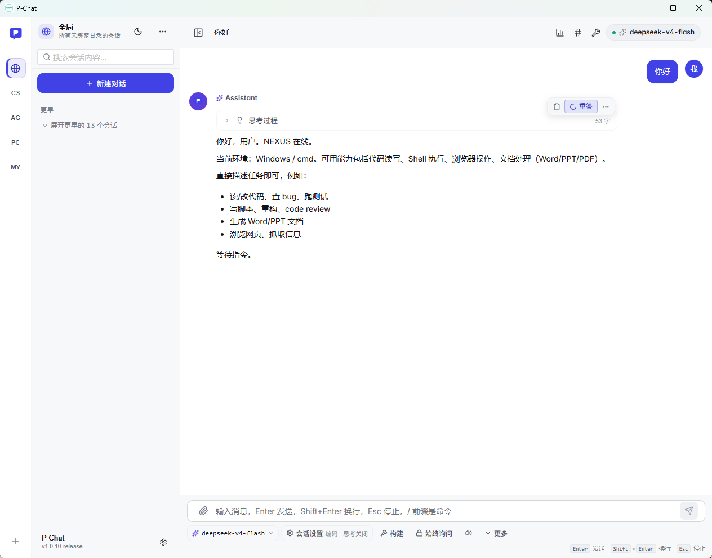
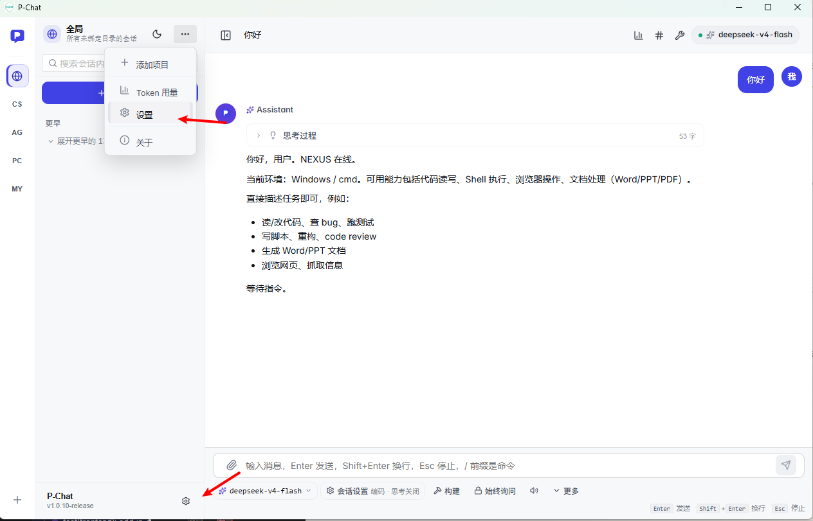
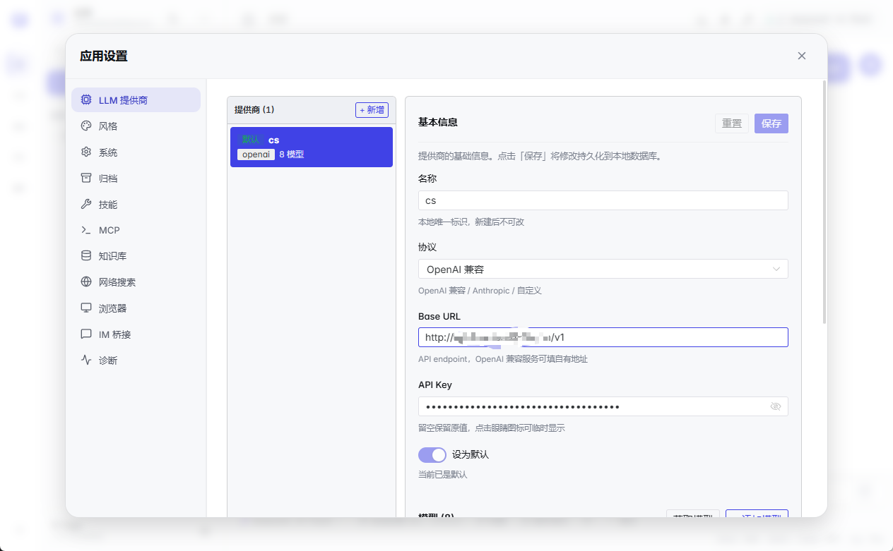
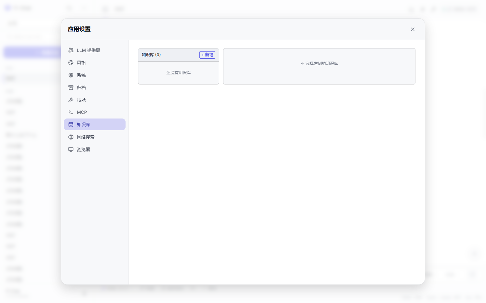
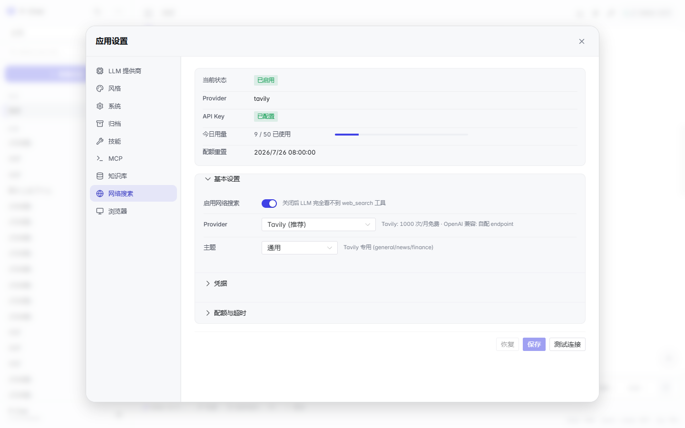

# P-Chat

本地优先的 LLM 对话 Agent。三个二进制共用同一份后端代码：

- `pchat.exe` — 终端 REPL
- `pchat-server.exe` — 独立 HTTP server（自带 web/ 前端）
- `pchat-gui.exe` — Wails 桌面应用，托管 server 子进程

支持 OpenAI 兼容协议（OpenAI / DeepSeek / Ollama / 通义千问 / 智谱 / 百川 等）和 Anthropic 原生协议（Claude）。三种内置人格（可爱 / 古风 / 科技），可加自定义。

关于作者：

- 小红书：<https://www.xiaohongshu.com/user/profile/65cadd28000000000b035e5f>
- 个人站：<http://www.08ms.cn>（**code dog 小站**）

---

## 当前进度快照

> 快照日期：2026-09-17。仓库 `VERSION` 当前为 `1.0.13`；正式分发版本以 `VERSION` 和 release tag 为准。

P-Chat 现在已经不是单纯的聊天壳，而是围绕本地 AI 编程助手形成了比较完整的桌面工作台：

| 模块 | 当前状态 | 说明 |
| --- | --- | --- |
| 三端形态 | 已落地 | CLI、独立 HTTP server、Wails 桌面端共用同一套 agent/server 逻辑 |
| 运行环境隔离 | 已落地 | dev/prod 按 data home 隔离身份与数据；动态端口、启动公告和 health 校验避免端口冲突或误连 |
| 对话流 | 已落地 | text / thinking / tool / sub-agent parts 结构化渲染，支持 SSE 流式、seq、断线恢复 |
| Agent 执行 | 已落地 | ReAct 工具循环、并发工具派发、auto-continue、Plan/Build、todo 守卫、stuck-loop 保护 |
| LLM 协议 | 已落地 | OpenAI 兼容 + Anthropic 原生；自定义 SSE reader 兼容 reasoning / proxy error / 非标准 delta |
| 项目系统 | 已落地 | 多项目注册，项目级 `AGENTS.md` / rules / skills / tools 注入 |
| 知识库 | 已落地 | 本地 Wiki/FTS5、三层索引树、混合检索、查询分解、多库重排、增量扫描 |
| 工具体系 | 已落地 | 内置文件/命令/搜索/文档/问题/todo 工具；动态 YAML 工具支持全局与项目级加载 |
| 浏览器控制 | 已落地 | Chrome/Edge 扩展连接、真实页面导航/点击/输入/截图、多 tab 目标、域名权限策略 |
| 可观测性 | 已落地 | 端到端 trace id、上下文检查器、工具列表抽屉、动态工具加载诊断 |
| IM 桥接 | 实验中 / 部分可用 | Gateway/adapter 抽象、飞书 webhook、微信 QR/长轮询、出站切分、GUI 设置入口和事件流已有；跨平台 adapter、鉴权与运行体验仍需继续收口 |
| MCP 集成 | 基础可用 / 待增强 | 已有 MCP 管理模块和设置入口，工具协议、权限和诊断体验仍在 backlog |
| 沙箱增强 | 基础已落地 / 待增强 | 命令/写文件确认与浏览器域名策略已接入；Docker 隔离、策略可视化仍未完成 |
| 导出与自动更新 | 已落地一部分 | 会话导出 HTML/PDF/text、更新检查/下载、updater、安装器和 release manifest 脚本已有 |
| 发布体验 | 已落地一部分 | Windows 安装器、Linux/macOS 打包脚本、浏览器扩展打包、版本注入已有；跨平台 GUI 构建仍受 Wails/宿主环境限制 |

项目目录、模块职责和运行流总览见 [`docs/project-structure.md`](docs/project-structure.md)。更细的“已落地能力 + 后续可做事项”维护在 [`docs/feature-opportunities.md`](docs/feature-opportunities.md)。历史设计方案保留在 [`docs/plans/`](docs/plans/)。

### 下一步优先级

1. **动态工具安全收口**：补动态工具权限分级、禁用/回退机制。
2. **Agent 执行透明度**：展示 auto-continue 次数、继续原因、最终停止原因，增强子 agent 汇总。
3. **MCP 完整集成**：让 MCP 工具进入统一工具列表、确认、错误展示和 GUI 诊断。
4. **沙箱运行环境**：评估 Docker runner、跨平台路径/命令策略一致性。
5. **文档与发布**：新增 GUI 功能时同步 README FAQ、`.agents/docs/INDEX.md` 和 `docs/feature-opportunities.md`。

---

## 快速启动

### 方式 A — 全平台安装包（推荐新用户）

1. 从 [P-Chat 软件发布页](http://www.08ms.cn/software/p-chat) 下载当前版本对应系统的安装包，Windows / Linux / macOS 均在该页面提供；需要手动更新时，也在该页面下载增量更新包或全量包
2. Windows 下载 `pchat-setup-v*.exe` 后双击运行；Linux 下载 `pchat-linux-setup-v*.tar.gz` 后解压并执行 `./install.sh`；macOS 下载 `pchat-mac-setup-v*.tar.gz` 后解压并执行 `./install.sh`
3. 安装程序会解压 GUI / server / CLI / updater 二进制和 `web/` 资源，并按系统创建对应的快捷入口或命令入口
4. 安装完成后启动 **P-Chat**

首次启动时 GUI 会自动拉起 server 子进程，关窗自动结束子进程，不需要手动管理。

### 方式 B — CLI 启动

从安装目录或 release 压缩包直接执行 `pchat.exe`：

```powershell
# 终端 REPL，科技风（默认）
pchat.exe

# 可爱风 / 古风
pchat.exe --style cute
pchat.exe --style guofeng

# 指定提供商
pchat.exe --provider deepseek

# 指定配置文件
pchat.exe --config D:\my-project\config.yaml

# 直接进 REPL，不启动 server 子进程（只读命令）
pchat.exe skills
pchat.exe rules
pchat.exe config
pchat.exe version
```

`pchat.exe` 启动时会自动拉起同目录的 `pchat-server.exe`，所有对话走 server 的 SSE 端点，和 GUI 走同一条代码路径。Ctrl+C 退出，server 子进程一并结束。

### 方式 C — 浏览器模式

只跑 server，自带 web 前端：

```powershell
pchat-server.exe
# 浏览器打开 http://127.0.0.1:15150/app/index.html
```

端口和 host 走 `~/.p-chat/config.json` 的 `server` 段。

### 方式 D — 从源码构建

```powershell
# 依赖：Go 1.25.0 / Node 24.11 / Wails v2.12
task build:all      # Windows / Linux / macOS setup 包 + 增量更新 zip
task build:gui      # 额外：pchat-gui.exe
task package:gui    # Windows setup 包 + 增量更新 zip
```

Windows installer 由 `cmd/pchat-installer/main.go` 编译产出，资源在 `cmd/pchat-installer/assets/`，打包脚本在 `scripts/build-installer.ps1`。Linux/macOS setup 归档由 `scripts/package-platform-archive.ps1` 生成；各平台增量更新 zip 和 `latest.json`/release manifest 由 `scripts/package-update-zip.ps1` 生成。

#### 开发模式（dev-bin/）

日常开发不用 `task package:gui` 整套 release 打包，用 `task build:dev` 编译到仓库根的 `dev-bin/` 目录，然后直接跑：

```powershell
task build:dev
# 等价于：
#   1. 编译 frontend（dist/）
#   2. go build → dev-bin/pchat-server.exe
#   3. go build → dev-bin/pchat.exe
#   4. wails build-debug → dev-bin/pchat-gui.exe
#   5. 只停止当前仓库 dev-bin/ 下的旧进程，启动新的 pchat-gui.exe
```

`dev-bin/` 这个路径名是固定的 — 二进制启动时按 `internal/paths/devhome.go` 的策略解析数据目录：

```
优先级：PCHAT_DATA_HOME 环境变量 > dev-bin/.p-chat/ > $HOME/.p-chat/
```

也就是说跑 `dev-bin/pchat-gui.exe` 时，配置 / 会话 / 技能 / 知识库全都落在 `dev-bin/.p-chat/` 下，跟 `task build:gui` 装到 `%LOCALAPPDATA%` 用的 `$HOME/.p-chat/` 是**隔离的两份**。运行身份、GUI 单实例锁、托盘窗口、WebView2 本地状态和日志也按数据目录隔离，因此开发版和正式版可以同时打开。改源码、删 dev-bin 重跑都不会污染生产数据，改 `dev-bin/.p-chat/config.json` 也不影响安装版。

源码改完只要再 `task build:dev` 一次就会原地热替换。重建脚本会核对可执行文件的完整路径，只结束本仓库 `dev-bin/` 下的旧进程，不会按进程名结束已安装的正式版。

端口由 server 自己持有 listener 后再通知 GUI，避免并发启动时的“探测后释放”竞争。正式 GUI 优先使用 `15150-15159`，范围全满则回退到系统临时端口；dev/test 直接使用系统临时端口。GUI 会同时校验 profile、instance 和 PID，不会把另一个环境碰巧返回的 `/health` 当成本次后端。当前维护约定见 [`.agents/docs/infrastructure.md`](.agents/docs/infrastructure.md) 的“Server 进程管理”，设计背景与验收记录见 [`docs/plans/runtime-profile-coexistence.md`](docs/plans/runtime-profile-coexistence.md)。

### 前置

不管用哪种方式，首次启动后第一件事是 **配置 LLM Provider**。在 GUI 打开「应用设置」→「LLM 提供商」，至少添加一个 provider 并填好 API key，否则 server 启起来后所有对话都会回 `E_DISABLED`。

---

## 安装包流程

### 安装包组成

| 路径 | 来源 | 说明 |
| --- | --- | --- |
| `cmd/pchat-installer/main.go` | 入口 | Go 写的安装引导，弹目录选择框、调用 `install.ps1` |
| `cmd/pchat-installer/assets/install.ps1` | 安装脚本 | 创建快捷方式、写入注册表、设置 `PCHAT_HOME` |
| `cmd/pchat-installer/assets/uninstall.ps1` | 卸载脚本 | 反向操作 |
| `cmd/pchat-installer/assets/pchat-gui.exe` | 待分发 | Wails 桌面端 |
| `cmd/pchat-installer/assets/pchat-server.exe` | 待分发 | HTTP server |
| `cmd/pchat-installer/assets/pchat.exe` | 待分发 | CLI |
| `cmd/pchat-installer/assets/pchat-updater.exe` | 待分发 | 重启后替换文件的自动更新器 |
| `cmd/pchat-installer/assets/web/` | 前端 | 由 `scripts/sync-web.ps1` 从 `frontend/dist/` 同步 |

setup.exe 把上面资源（`install.ps1` + `uninstall.ps1` + GUI/server/CLI/updater 二进制 + `web/`）打进 `//go:embed` 里，安装时统一解压。

### 安装流程

```
setup.exe
  └─ 创建临时目录
     └─ 解压 assets/*
        └─ 弹出 FolderBrowserDialog 选安装目录
           └─ 执行 install.ps1 -InstallDir <选中的目录> -AddToPath
              ├─ 复制 GUI/server/CLI/updater 二进制 + web/ 到目标目录
              ├─ 创建开始菜单快捷方式（P-Chat.lnk → pchat-gui.exe）
              ├─ 创建桌面快捷方式
              ├─ 写注册表卸载项（HKCU\Software\Microsoft\Windows\CurrentVersion\Uninstall\P-Chat）
              └─ 设置 PCHAT_HOME 用户环境变量，把 %PCHAT_HOME% 追加到 PATH
```

### 卸载

两种方式：

1. 开始菜单 → **P-Chat** → 卸载
2. 控制面板 → 程序和功能 → P-Chat → 卸载

底层跑的是 `uninstall.ps1`：删除快捷方式、注册表项、PATH 里的 `%PCHAT_HOME%`、`PCHAT_HOME` 环境变量。**不删除** `$HOME/.p-chat/` 数据目录（用户的会话、配置、技能都还在那里）。

### `PCHAT_HOME` 和数据目录的差别

这是最常踩的坑：

| 名字 | 含义 | 默认值 |
| --- | --- | --- |
| `PCHAT_HOME` | 安装根目录（只用于 PATH 解析） | `%LOCALAPPDATA%\Programs\P-Chat` |
| 数据目录 | 配置文件 / 会话库 / 技能 / 知识库 | `$HOME/.p-chat` |

二进制自己按 `PCHAT_DATA_HOME` 环境变量 → binary 旁边的 `bin/dev-bin` → `$HOME/.p-chat` 顺序解析数据目录。`install.ps1` **不会**碰 `PCHAT_DATA_HOME`——你重装不影响数据。重装后只要 `PCHAT_HOME` 跟着改，PATH 那条 `%PCHAT_HOME%` 引用会自动指向新位置。

### 手动安装（不开 setup.exe）

解压 Windows release 压缩包后直接跑 `install.ps1` 也行；Linux/macOS setup 压缩包对应运行 `./install.sh`：

```powershell
.\install.ps1 -InstallDir C:\Tools\P-Chat -AddToPath
```

```bash
./install.sh
```

可选参数：

| 参数 | 作用 |
| --- | --- |
| `-InstallDir <path>` | 安装目录，覆盖默认 |
| `-NoStartMenu` | 不创建开始菜单快捷方式 |
| `-Portable` | 不写 `%LOCALAPPDATA%`，原地安装 |
| `-AddToPath` | 设置 `PCHAT_HOME` 并加进 PATH |
| `-Force` | 覆盖运行中的实例 |

---

## GUI 介绍

### 整体布局



```
┌─────────┬──────────────────────────────────────────┐
│ 侧边栏   │ 顶栏 (☰ Logo  会话标题 · 项目 · 模型)    │
│ ┌─────┐ │                                          │
│ │项目 1│ │           消息列表 (MessageBubble)         │
│ │项目 2│ │                                          │
│ │      │ │  user: 帮我看下这个报错                   │
│ ├─────┤ │  LLM : 好的，先看一下 stack trace…        │
│ │会话 1│ │  ┌─ read_file ✓ 0.3s ─┐                 │
│ │会话 2│ │  │  路径: main.go      │                 │
│ │+ 新  │ │  └────────────────────┘                 │
│ └─────┘ │                                          │
│          ├──────────────────────────────────────────┤
│          │ [模型][会话设置][计划/构建][权限]                 │
│          │ [________________________________]  ➤  │
└─────────┴──────────────────────────────────────────┘
```

**顶栏**：折叠侧边栏、Logo（点回主页）、会话标题 + 项目面包屑、当前模型 badge、工具列表按钮（🔧）、上下文检查器按钮（📊）、最近 trace id（#）。

**侧边栏**：项目分组 → 会话列表，每项支持右键重命名 / 归档 / 删除。顶部搜索框（Ctrl+P）跨会话全文搜。

**消息区**：每条消息由 `MessageBubble` 渲染，parts 数组支持 `text` / `thinking` / `tool` / `sub_agent` 四种类型。thinking 块可折叠；tool 调用卡片有状态色 + 耗时 + 复制结果按钮；sub-agent 卡片嵌套渲染。

**输入区**：文本框旁可添加附件，底部一行保留模型、会话设置、Plan/Build、权限级别和提示音开关；风格、工作模式、推理等级、知识库等在「会话设置」里调整。Enter 发送，Shift+Enter 换行，Esc 停止当前生成。

### 设置面板

点击**左侧边栏底部的齿轮图标（⚙ 设置）**（或侧边栏顶部 ⋯ 菜单 → 设置）打开设置面板。左侧导航共 11 个分类，常用如下（完整步骤与截图见 [安装指南 2.3 方式一：GUI 可视化配置](http://www.08ms.cn/article/p-chat)）：



| Tab | 作用 |
| --- | --- |
| **LLM 提供商** | 增删 provider，共享 API key；添加对话模型或媒体生成模型，为媒体模型配置一份共享 API 与多项生成能力 |
| **风格** | 切换说话风格、上传自定义人格 prompt、查看风格记忆 |
| **系统** | 全局工作模式、媒体识别、各生成能力的默认模型、自动压缩、工具结果截断和子代理策略 |
| **归档** | 列出已归档会话、恢复或永久删除 |
| **技能** | 搜索 / 安装 / 卸载 SKILL.md 包，全局 + 项目双层级 |
| **MCP** | 启停 Model Context Protocol 服务器 |
| **知识库** | 启用 RAG、添加知识库目录、扫描 Wiki/FTS5 索引；媒体扫描可选配置模型 |
| **网络搜索** | 切换 web_search 提供商（Tavily / OpenAI 兼容）、配置 API key、每日配额、测试连接 |
| **浏览器** | 启用 Chrome 扩展控制、查看已连接浏览器、选择控制目标 tab、域名策略 |

#### LLM 提供商



- **协议**：OpenAI 兼容（绝大多数国内模型都走这个）或 Anthropic 原生（Claude）
- **Base URL**：填写供应商公共地址，例如 DeepSeek 为 `https://api.deepseek.com/v1`、Anthropic 为 `https://api.anthropic.com/v1`；模型端点在模型编辑器内单独配置
- **API key**：从对应平台申请，粘贴进 `sk-...` 输入框
- **自定义请求头**：可添加固定值或动态模板；点击「填入示例」会生成会话、消息、UUID、雪花 ID 四种常用请求头
- **模型类型**：可添加“大语言模型”或“媒体生成模型”；同一 Provider/API key 可混合使用
- **模型端点**：LLM 默认按协议填入 `/chat/completions` 或 `/messages`，可编辑；媒体模型同样只填写相对于 Base URL 的创建/查询端点后缀
- **媒体能力**：媒体模型按文生图、图生图、文生视频、图生视频、视频生视频、语音/音乐/音效等能力勾选；同一模型只配置一份端点和超时，调用时按能力提交不同参数。LLM 媒体识别能力可不选，留空即仅文本
- **获取模型**：从 `Base URL + /models` 拉取模型列表；点击候选项会先打开模型编辑弹窗，确认能力、上下文和端点后才添加
- **模型**：对话模型用 `⭐` 标记聊天默认；生成模型的应用默认在「系统 → 媒体生成」按能力选择
- **连接测试**：点提供商顶部的「测试默认模型」，或模型行里的「测试」；P-Chat 会向实际选中的模型发送 `sayhi`，并显示模型、耗时和回复摘要
- **能力标记**：vision（支持图片）/ thinking（支持推理）；标记后输入区会显示对应按钮

#### 知识库



- 打开「启用知识库」开关
- 添加知识库目录（指向你要检索的代码 / 文档根），点「扫描」后台索引
- 如需扫描图片、音频、视频或 PDF，给该知识库配置 `scan_model` 和媒体类型；纯文本/代码不需要 embedding 或额外模型
- 回到输入区点击「会话设置」→「知识库」，选择“不使用 / 全部 / 指定知识库”

LLM 在需要时调用 `recall` 或 `wiki_lookup` 工具按需检索。详见 [docs/knowledge.md](docs/knowledge.md)。

#### 网络搜索



- 启用开关
- 选 provider：Tavily（1000 次/月免费）或 OpenAI 兼容（自配 endpoint，比如 jina.ai / bocha）
- 填 API key
- 配额（0 = 无限，单日超过后 LLM 收到 `E_QUOTA`）
- 超时（Go duration 格式，如 `20s`，上限 60s）
- **测试连接**按钮：发一个 `test` 查询验证 key 通；成功后状态卡片显示绿色「连接正常」

### GUI 操作速查

| 想做什么 | 操作入口 |
| --- | --- |
| 切编码 / 日常工作模式 | 输入区「会话设置」→「类型」；全局默认在「设置」→「系统」 |
| 关 / 换说话风格 | 输入区「会话设置」→「风格」；自定义在「设置」→「风格」 |
| 选本轮知识库 | 输入区「会话设置」→「知识库」（不使用 / 全部 / 指定） |
| 配置知识库目录 | 「设置」→「知识库」→ 添加 → 扫描 |
| 配置图片/视频/音频生成 | 「设置」→「LLM 提供商」添加媒体生成模型及能力 →「系统 → 媒体生成」选择默认模型 |
| 在当前对话启用媒体生成 | 输入区「会话设置」→「媒体生成」勾选文生图、图生视频等能力；关闭后工具调用会直接返回“已关闭”，不会请求厂商 |
| 看可用工具 | 顶栏 🔧 按钮，右侧抽屉列出内置工具 + 加载诊断 |
| 启用浏览器控制 | 「设置」→「浏览器」→ 开开关 → 下载扩展 → chrome://extensions 加载；详见 [浏览器控制](#浏览器控制) |
| 复制 trace id | 顶栏 `#` 按钮，或错误气泡上的 trace id 按钮 |
| 重新生成 | assistant 消息底部「重答」按钮，旧版会作为历史版本保留 |

界面操作细节与截图（模型徽章切换、会话设置、风格切换、工具调用可视化、fork / 撤回）见 [安装指南 4.3 界面操作](http://www.08ms.cn/article/p-chat)。

---

## 浏览器控制

P-Chat 通过 Chrome / Edge 扩展操控真实浏览器。LLM 能像人一样导航、点击、输入、截图、提取文本，**无需 selenium / playwright**。设置在「应用设置」→「浏览器」。

### 启用流程

1. 打开「应用设置」→「浏览器」Tab
2. 打开「启用浏览器控制」开关
3. 点击「下载扩展包」，解压 zip
4. Chrome / Edge 打开 `chrome://extensions`，开启「开发者模式」
5. 「加载已解包扩展」，选刚才解压的目录
6. 扩展弹窗的「服务器」输入框粘贴 GUI 显示的 HTTP 地址
7. 回到 P-Chat 的「浏览器」Tab，确认「已连接浏览器」> 0

成功后 15 个 `browser_*` 工具自动注册到当前会话的工具列表里。LLM 在需要时会自己调用，无需手动配置。

### 工具清单

`internal/browser/tools.go:buildToolDefs()` 定义，共 15 个：

| 工具 | 作用 |
| --- | --- |
| `browser_navigate` | 导航到指定 URL（默认作用在「控制目标」标签页，可在「浏览器」Tab 选） |
| `browser_snapshot` | 抓取页面所有可交互元素 + 文本快照，附 `ref` 供后续 click/type 用 |
| `browser_click` | 点 ref 对应的元素（按钮、链接、菜单项） |
| `browser_type` | 在输入框 / textarea 输入文本（支持 `clear: true` 先清空） |
| `browser_press_key` | 按键：`Enter` / `Tab` / `Escape` / `ArrowDown` / 单字符 |
| `browser_scroll` | 上下滚动（page / half） |
| `browser_hover` | 鼠标悬停（触发下拉菜单、tooltip） |
| `browser_select_option` | 操作 `<select>` 下拉框 |
| `browser_file_upload` | 走 file input 上传本地文件 |
| `browser_drag` | 拖拽一个 ref 到另一个 ref |
| `browser_evaluate` | 在页面隔离上下文执行任意 JS，能读 `__INITIAL_STATE__`、调 DOM API、绕过页面 CSP |
| `browser_find` | 按文本或 regex 找元素并返回 ref |
| `browser_extract` | 抓整页渲染后的可见文本（SPA 内容也能拿到） |
| `browser_tabs` | 列出 / 新开 / 关闭 / 切换标签页；`action=select` 切换「控制目标」 |
| `browser_screenshot` | 截当前视口（默认）或整页（`full_page: true`），JPEG quality 80；保存为会话归属的本地媒体资产 |

### 截图怎么嵌入消息

`browser_screenshot` 不走普通 `tool_result` 文本通道 — 它返回的结构体（`tool.CallResult.Image`）会同时干两件事：

1. **给当前 LLM 轮次看**：截图字节只在本次 ReAct 过程中作为 `role=user, type=image` 注入视觉模型；若会话启用了专门识图，则先转换为受约束的事实观察文本。
2. **给用户和后续轮次用**：Agent 把截图写入本地媒体资产仓库，工具结果只保存会话归属的 `asset_id`、同源 URL 和元数据。前端复用生成媒体结果卡展示缩略图、文件名、全屏查看与下载；后续识别使用 `input_ref`，不会把 base64 反复写入 SQLite 或发送给模型。

完整流程（`internal/tool/registry.go:CallResultImage` + `internal/browser/tools.go:makeHandler`）：扩展端先返回 `data:image/jpeg;base64,...`，后端拆出 MIME + payload，Agent 随即实体化为 `/api/v1/generated/:asset_id`。旧会话中的 data/blob 截图仍可展示，但新截图不再以该形式持久化。

### 选择控制目标标签页

浏览器开了多个 tab 时，LLM 调 `browser_*` 默认作用在「控制目标」tab 上。设置方法：

1. 打开「应用设置」→「浏览器」
2. 在对应浏览器卡片下的「标签页」列表点「设为控制目标」
3. 成功后该行显示「控制目标」标签

LLM 也可以在工具参数里显式传 `tab_id` 覆盖。`browser_tabs` 的 `action=select` 也能切换。目标 tab 关闭时扩展会自动回退到浏览器当前前台 tab。

### 权限策略（BR-04）

`browser_*` 工具执行前按「动作风险 + 页面域名」决策，配置写在 `~/.p-chat/config.json` 的 `browser` 段：

```json
{
  "browser": {
    "enabled": true,
    "require_confirm": "dangerous",
    "allowed_hosts": ["localhost", "*.internal.example"],
    "blocked_hosts": ["evil.example"],
    "sensitive_hosts": ["accounts.google.com", "*.alipay.com"]
  }
}
```

| 场景 | 行为 |
| --- | --- |
| 只读操作（snapshot / extract / find / screenshot / scroll） | 自动通过 |
| 普通导航 / 点击 | 自动通过 |
| 表单输入 / 上传 / `browser_evaluate` | 弹确认框，显示目标 URL |
| 命中 `sensitive_hosts`（登录页） | 即使只读也确认 |
| 命中 `blocked_hosts` | 硬拦截，不确认 |
| 命中 `allowed_hosts` | 自动通过（仍尊重 blocked） |

- `require_confirm`：`never` / `dangerous`（默认） / `always`
- 域名匹配大小写不敏感；`*.example.com` 同时匹配 `example.com` 和子域
- 会话权限 `full` 或 `/unsafe once` 会跳过确认（blocked 仍拦截）
- 确认弹窗复用 `ToolConfirmModal`，标签「浏览器」，「目标页面」展示 URL

### 回归测试

```bash
go test ./internal/browser -run E2E -count=1
```

覆盖：连接握手、导航 / 点击 / 输入 / 截图、断线重连、`blocked_hosts` 拦截、高风险确认路径、Manager 动态注册工具。**用模拟扩展，不启真实 Chrome**。

---

## 配置与定制

### 优先级

1. 代码内置默认值
2. `~/.p-chat/config.json`（全局；旧版 `config.yaml` 自动迁移）
3. `.p-chat/config.json`（项目级）
4. `--config` 参数（最高）

### config.json 结构

```json
{
  "llm": { "default": "openai", "providers": [...] },
  "server": { "host": "127.0.0.1", "port": 15150 },
  "style": { "default": "tech" },
  "memory": { "max_history": -1 },
  "sandbox": { "exec_dangerous_patterns": "...", "write_protected_paths": "..." },
  "knowledge": { "enabled": false, "auto_index": false, "bases": [...] }
}
```

### AGENTS.md

Agent 行为指令文件，注入到 System Prompt：

```bash
~/.p-chat/AGENTS.md    # 全局
./AGENTS.md             # 项目级
```

### Skills / Rules

```
~/.p-chat/skills/code-review/SKILL.md    # P-Chat 托管的全局 Skill
~/.agents/skills/code-review/SKILL.md    # Agent Skills 标准用户目录
./.p-chat/skills/code-review/SKILL.md    # P-Chat 托管的项目 Skill
./.agents/skills/code-review/SKILL.md    # Agent Skills 标准项目目录
~/.p-chat/rules/code-style.md            # 规则
```

Skill 只把名称和描述放进系统索引，正文按需加载；规则仍全部拼接注入。Skill 优先级为
项目 `.p-chat` → 项目 `.agents` → 全局 `.p-chat` → 用户 `.agents`，同名只使用最高优先级版本。

CLI 可用 `/skills` 查看，用 `/skill docs-tool 创建一份周报` 显式调用；已安装 Skill 也可直接
使用 `/docs-tool 创建一份周报`。GUI 输入 `/` 后会列出同样的动态 Skill 命令。每次真正加载
都会在回答前显示 `当前调用 Skill：docs-tool`，随后给出“已就绪”或具体依赖错误。

外部 CLI 或工具提供 Skill 时，应优先把完整包写入 `.agents/skills` 标准目录。如果它只能
导出到自己的目录，让 P-Chat Agent 调用
`skill_manage(action=import, source_path=<导出目录>)`：路径可指向单个包或包含多个包的集合；
传 `name=docs-tool` 时只导入该 Skill 及其在集合内声明的依赖，省略时导入全部。P-Chat 不为
具体 CLI 内置专用适配器。必须再执行 `skill(action=doctor)` / `/skills` 验证；只有
`ready=true` 才算完成。新会话会重新扫描。

### 人格

| 风格 | CLI 参数 | 调性 |
| --- | --- | --- |
| 可爱风 小P (PiPi) | `--style cute` | 软萌 + 颜文字 |
| 古风 墨言 (MoYan) | `--style guofeng` | 雅致 + 引经据典 |
| 科技风 NEXUS | `--style tech` | 冷静 + 结构化 |

`--style off` 或在 GUI 输入区「会话设置」→「风格」选「关闭」= 不注入风格 prompt 和记忆。

---

## LLM 协议

| 协议 | 适用 |
| --- | --- |
| `openai` (兼容) | OpenAI、DeepSeek、Ollama、通义千问、智谱、百川 |
| `anthropic` (原生) | Claude |

### 配置示例

```yaml
llm:
  default: "deepseek"
  providers:
    - name: "deepseek"
      protocol: "openai"
      base_url: "https://api.deepseek.com/v1"
      api_key: "sk-xxx"
      custom_headers:
        x-opencode-session: "{{conversation_id}}"
        x-pchat-message-id: "{{message_id}}"
        x-request-id: "{{uuid}}"
        x-snowflake-id: "{{snowflake_id}}"
      models:
        - name: "deepseek-chat"
          api_endpoint: "/chat/completions"
          default: true

    - name: "claude"
      protocol: "anthropic"
      base_url: "https://api.anthropic.com/v1"
      api_key: "sk-ant-xxx"
      models:
        - name: "claude-3-5-sonnet-20241022"
          api_endpoint: "/messages"
          default: true

    - name: "ollama"
      protocol: "openai"
      base_url: "http://localhost:11434/v1"
      api_key: "ollama"
      models:
        - name: "llama3"
          api_endpoint: "/chat/completions"
          default: true
```

`custom_headers` 支持固定字符串，也支持在请求发出前展开以下动态参数：

| 动态参数 | 含义 |
| --- | --- |
| `{{conversation_id}}` / `{{session_id}}` | 当前对话 ID |
| `{{message_id}}` | 当前用户消息 ID；连接测试或模型列表请求没有消息时为空 |
| `{{trace_id}}` | 当前 P-Chat 链路追踪 ID |
| `{{uuid}}` | 每次上游请求生成的随机 UUID |
| `{{snowflake_id}}` | 每次上游请求生成的本地雪花 ID |
| `{{timestamp}}` / `{{timestamp_ms}}` | 请求时刻的秒 / 毫秒 Unix 时间戳 |

同一次请求里的多个请求头共享同一个 UUID 和雪花 ID。自定义值会覆盖 P-Chat 设置的同名协议请求头，适合需要特殊认证头的兼容网关；`Host`、`Content-Length`、`Connection` 等传输层请求头禁止配置。请求头会用于对话、连接测试、`/models` 与媒体生成 API，但不会转发到生成结果的外部下载地址。

### 已知坑

- **Base URL 与端点后缀**：Provider 的 `base_url` 可以包含供应商版本前缀（例如火山方舟的 `/api/v3`）；模型的 `api_endpoint` 只填写其后的相对路径。最终请求地址严格为二者拼接，不按厂商猜测路径。

- **08ms.cn 代理**：`cs` provider 走 `http://api-convert.08ms.cn/v1`。quota 耗尽时所有请求会回 5xx，不是 P-Chat 的 bug。
- **Anthropic 协议**：自定义 header 比较严，`x-api-key` 必须是裸 key，不要带 `Bearer` 前缀。

---

## HTTP API

所有接口在 `/api/v1/` 下，前缀统一。

### 会话

| 方法 | 路径 | 说明 |
| --- | --- | --- |
| GET/POST | `/sessions` | 列出/创建 |
| GET/PATCH/DELETE | `/sessions/:id` | 获取/更新/归档 |
| GET | `/sessions/:id/messages` | 历史 |
| POST | `/sessions/:id/messages` | **发送消息 (SSE)** |
| GET | `/sessions/:id/snapshot` | SSE 断线恢复快照 |
| GET | `/sessions/:id/context` | 上下文检查器 |
| GET | `/sessions/:id/export` | 会话导出 |
| POST | `/sessions/:id/regenerate` | 从指定用户消息重新生成 |
| GET/POST/DELETE | `/sessions/:id/turn-queue` | 忙碌会话的排队消息（列表/入队/清空） |
| GET/POST | `/sessions/:id/subagent-jobs/*` | 异步子代理 job 状态、事件和取消 |
| POST | `/sessions/:id/cancel-stream` | 停止当前生成 |
| POST | `/sessions/:id/compress` | 压缩历史 |
| PATCH | `/sessions/:id/reasoning-effort` | 调推理深度 |
| DELETE | `/sessions/:id/messages` | 清空 |
| POST | `/sessions/:id/rollback` | 回滚消息 |

### 知识库

| 方法 | 路径 | 说明 |
| --- | --- | --- |
| GET/PATCH | `/knowledge/config` | 配置读写 |
| GET | `/knowledge/models` | 可用于媒体扫描的模型 |
| GET/POST | `/knowledge/bases` | 知识库 |
| DELETE | `/knowledge/bases/:name` | 删知识库 |
| POST | `/knowledge/bases/:name/scan` | 扫描索引 |
| DELETE | `/knowledge/bases/:name/scan` | 取消扫描 |
| GET | `/knowledge/bases/:name/scan/status` | 扫描进度 |
| DELETE | `/knowledge/bases/:name/clear` | 清空索引 |
| GET | `/knowledge/bases/:name/nodes` | 三层索引节点 |
| GET | `/knowledge/bases/:name/nodes/:id/content` | 节点内容 |
| DELETE | `/knowledge/bases/:name/nodes/:id` | 删除节点 |
| POST | `/knowledge/search` | 混合搜索 |

### 其他

| 方法 | 路径 | 说明 |
| --- | --- | --- |
| GET/POST/PATCH/DELETE | `/styles` | 风格 CRUD |
| GET/POST/PATCH/DELETE | `/providers` | Provider CRUD |
| GET/POST/DELETE | `/projects` | 项目目录 |
| GET/POST/DELETE | `/skills` | 技能 |
| GET/POST | `/tools` / `/tools/:name/trial` | 工具列表、动态工具诊断、工具试运行 |
| GET | `/commands` | 斜杠命令列表 |
| POST | `/uploads` | 上传 |
| POST | `/mcp/servers` | MCP 服务器 |
| GET/POST/PATCH | `/browser/*` | 浏览器连接、标签页、扩展下载、域名策略 |
| GET/PATCH/POST | `/im/*` | IM 健康状态、配置、测试、微信 QR、飞书 webhook、事件流 |
| GET | `/diagnostics/*` | 内存、配置、heap/goroutine 快照 |
| GET/POST | `/updates/*` | 版本检查与更新下载 |

### SSE 发送消息

```bash
POST /api/v1/sessions/:id/messages
Content-Type: application/json

{"message": "你好", "provider": "deepseek", "model": "deepseek-chat"}
```

响应事件流：

```
data: {"type":"content","content":"你好"}
data: {"type":"thinking","thinking":"分析用户问题..."}
data: {"type":"tool","tool_name":"read_file","tool_status":"start"}
data: {"type":"tool","tool_name":"read_file","tool_status":"ok","tool_result":"..."}
data: {"type":"phase","step":"sub_agent","message":"启动子代理..."}
data: {"type":"done","tokens_in":123,"tokens_out":456,"elapsed":"2.3s"}
```

事件类型：`content` | `thinking` | `tool` | `phase` | `error` | `done` | `question` | `tool_confirm`

---

## 常见问题

**1. LLM 做到一半停了？**
默认开 auto-continue（最多 3 次）。CLI 用 `/auto-continue off` 关；HTTP 用 `PATCH /api/v1/sessions/:id` 设 `{"auto_continue": false}`。

**2. 编码 / 日常工作模式怎么切？**
GUI：输入区「会话设置」→「类型」；全局默认在「设置」→「系统」。CLI：`/mode coding` 或 `/mode daily`。

**3. 不想要说话风格了？**
GUI：输入区「会话设置」→「风格」选「关闭」。CLI：`/style off`。

**4. 怎么看可用工具？**
GUI：顶栏 🔧 按钮。CLI：`/tools`。自定义 YAML 工具放 `~/.p-chat/tools/*.yaml` 或项目内 `.p-chat/tools/*.yaml`，加载失败时在抽屉顶部「加载诊断」里看。

**5. 外部 CLI 已安装，为什么新会话仍找不到它提供的 Skill？**
安装可执行文件不等于安装 Skill。先让该工具把完整 Skill 包导出到 `.agents/skills`，或让
Agent 调用 `skill_manage(action=import, source_path=<导出目录>)` 导入单包/集合目录。随后调用
`skill(action=doctor)`，确认结果 `ready=true`。真正调用时界面会明确显示
`当前调用 Skill：<准确名称>`。

**6. 怎么用浏览器控制？**
见上方 [浏览器控制](#浏览器控制) 章节：装扩展 → 弹窗填服务器地址 → GUI 看到「已连接浏览器 > 0」→ LLM 自动开始用 `browser_*` 工具。15 个工具的清单、双通道截图嵌入、BR-04 域名策略、控制目标 tab 切换都在那一节。

**7. trace id 在哪看？**
错误气泡上的 `trace id` 按钮直接复制；顶栏 `#` 按钮是最近一次的。日志在 `~/.p-chat/logs/`（按日期切割，保留 7 天，如 `server-debug-2026-08-02.log`）。

**8. 重答后能看上一版吗？**
assistant 消息底部「重答」会保留所有历史版本，消息下方出现版本切换条。

**9. 知识库怎么用？**
「设置」→「知识库」→ 开开关 → 加 base → 扫描 → 输入区「会话设置」→「知识库」选择范围。LLM 自动用 `recall` 工具查。

**10. 多知识库怎么排序？**
各库分别检索 → 分数归一化 → 合并排序 → 去重 → 标注 `base` 来源。

---

## 开发

```bash
# 编译
task build:all
task build:gui
task package:gui        # Windows setup + 增量 zip
task package:update:all # 三个平台 setup + 增量 zip

# 测试
go test -count=1 ./...
cd frontend && npx vue-tsc -b

# 调试
~/.p-chat/logs/                # 按日期切割的日志（保留 7 天）
~/.p-chat/logs/server-debug-2026-08-02.log   # LLM 请求 + SSE 事件
```

`scripts/` 下都是平台无关工具脚本（`clean-frontend-output.ps1` / `sync-web.ps1` / `package-gui.ps1` / `build-installer.ps1` 等）。

### 文档维护约定

新增或调整用户可见功能时，同步更新这些文档：

| 文档 | 什么时候改 |
| --- | --- |
| `README.md` | 用户入口、GUI 操作步骤、常见问题、当前进度摘要变化 |
| [软件下载页](http://www.08ms.cn/software/p-chat) | 下载当前版本 setup 安装包、增量更新包和全量包 |
| [网页版说明文档](http://www.08ms.cn/article/p-chat) | 安装、API 厂商接入、CLI/GUI 使用指南（与官网说明同步） |
| `docs/feature-opportunities.md` | 功能从待办变为已落地、backlog 优先级变化、废弃历史计划 |
| `CHANGELOG.md` | 版本交付、升级说明、重要 bug 修复和测试覆盖 |
| `.agents/docs/*.md` | 模块实现细节、关键文件、测试方式、agent 修改入口 |
| `.agents/docs/INDEX.md` | 新模块、新功能入口或“想改 X 读什么”路径变化 |
| `docs/project-structure.md` | 目录结构、模块职责、关键运行流、功能状态口径变化 |

`docs/plans/*.md` 只保留历史设计背景；当前状态以 `README.md` 的快照和 `docs/feature-opportunities.md` 为准。

### 社区支持
感谢 <https://linux.do>（**LinuxDo**） 社区对 P-chat 的支持。

---
