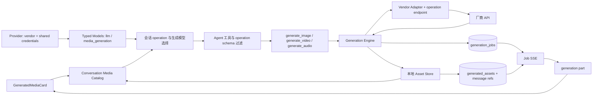
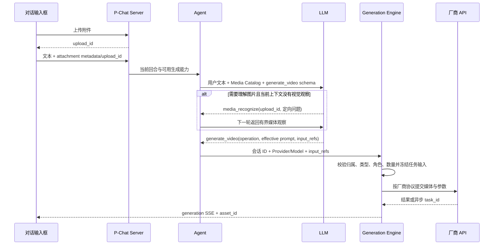

# 多媒体生成能力决策地图

> 实现进度（2026-09-06）：配置、会话开关、三个稳定工具、HTTP 执行器、本地资产和
> 对话预览的首个纵向切片已完成。与最初目标的差异及后续任务见
> [media-generation-implementation.md](media-generation-implementation.md)。

目标：让 P-Chat 在不同会话中按需启用图片、视频、音频生成工具；一个厂商账号/API key 可以同时挂载大语言模型和媒体生成模型；每个生成模型可按 operation 使用独立且可覆盖的 API 端点；用户上传或历史生成的媒体通过会话内 ID 交给工具，由 LLM 自主决定是否作为生成输入；生成结果可在对话中预览、下载、追问，并在重启后可靠恢复。

当前结论：把现有 Provider 从“LLM 接口”提升为“厂商账号与共享凭据边界”，在同一 Provider 下配置 `llm` 与 `media_generation` 两类模型。媒体模型显式声明 generation operation；应用为每个 operation 选择默认模型；会话只独立开关能力，运行时按应用默认路由。内置厂商 preset 提供默认 API，用户可逐项覆盖。配置与密钥复用 Provider，但执行仍由独立 Generation Engine 和厂商 adapter 负责。媒体生媒体只传会话内 ID，并支持直接生成或“先获得媒体观察、再由 LLM 完善有效提示词、最后生成”的串行工作流。模型侧保留三个稳定生成工具，所有结果统一落为持久化 job 和本地 asset。



## #1: 生成能力放在哪个配置域？

Blocked by: —
Type: Discuss
Status: Resolved

### Question

视频、图片、音频生成 API 应该完全独立于现有 Provider，还是与大语言模型共享厂商配置？

### Answer

采用“配置统一、运行时分离”：

- 复用现有 `llm.providers` 作为 Provider 列表，但概念和 GUI 名称改为“模型供应商”。Provider 表示厂商账号、共享 API key 和厂商标识，不再等于聊天 API。
- 在 `ModelConfig` 增加 `type: llm | media_generation`。旧模型缺少 `type` 时视为 `llm`，并通过 `internal/upgrade` 的下一版本步骤完成配置迁移。
- `generation` 顶层配置只保存确认策略、限额、全局默认生成模型等跨模型运行策略，不再新增一套厂商连接和 API key。
- Generation Engine、持久任务和资产库保持独立于 `internal/llm.Client`。共享配置不等于共享请求客户端。
- `recognition.routes` 仍只负责“媒体 → 描述”；动态工具可验证接口，但不承担生产级任务恢复、下载和展示。

现有代码中的 `ProviderConfig.Type` 是 `Protocol` 的兼容别名，不能复用为新的供应商类型。新增 `ProviderConfig.Vendor` 表示 `volcengine | minimax | openai | alibaba | custom`，新增的模型类型字段放在 `ModelConfig.Type`。

## #2: 如何表达不同厂商、端点和模型？

Blocked by: #1
Type: Discuss
Status: Resolved

### Question

怎样既允许每种生成操作配置独立厂商、模型和端点，又不把厂商协议细节泄漏到工具层？

### Answer

配置拆成三层，不再新增独立的生成连接器或命名路由实体：

1. **Provider**：厂商账号与共享凭据，例如一个火山 Provider 下共用一个 API key。
2. **Typed Model**：每个模型声明 `type=llm` 或 `type=media_generation`。聊天链路只看前者，生成链路只看后者。
3. **Operation API**：媒体生成模型按 operation 保存端点覆盖、同步/异步模式、输入传输、默认参数和约束。同一个模型可以支持多个 operation，每个 operation 可以有不同端点。

媒体模型的能力不是根据模型名或输出类型猜测，而是显式声明为 canonical operation。`generation.operations` 中存在的键就是该模型的 **Model Generation Capabilities**；图片/视频/音频分组由 operation 推导，不再单独保存一个可能冲突的 `output_media_kind`。例如同一个视频模型可以同时勾选 `text_to_video` 和 `image_to_video`，分别保存各自端点和约束。

首批规范化 operation 建议为：

| 输出工具 | Operation | 必需输入 |
| --- | --- | --- |
| `generate_image` | `text_to_image` | 文本提示词 |
| `generate_image` | `image_to_image` | 文本提示词 + 1..N 张图片 |
| `generate_video` | `text_to_video` | 文本提示词 |
| `generate_video` | `image_to_video` | 文本提示词 + 起始图；可选结束图 |
| `generate_video` | `video_to_video` | 文本提示词 + 视频 |
| `generate_audio` | `text_to_speech` | 待读文本；可选音色 |
| `generate_audio` | `text_to_music` | 音乐提示词；可选时长 |
| `generate_audio` | `text_to_sound` | 音效提示词；可选时长 |
| `generate_audio` | `audio_to_audio` | 音频 + 转换提示词 |

operation 是 P-Chat 的稳定词汇；厂商接口里的名称只在 adapter 内映射。以后新增对口型、数字人、图片生成音频等能力时追加新的规范化 operation，不复用一个含义不清的 `custom`。

建议配置形状（示例端点是结构占位符，不代表任何厂商的真实地址）：

```json
{
  "llm": {
    "providers": [
      {
        "name": "volcengine-main",
        "vendor": "volcengine",
        "protocol": "openai",
        "base_url": "<chat-api-base>",
        "api_key": "<shared-api-key>",
        "models": [
          {
            "name": "<chat-model-id>",
            "type": "llm",
            "default": true
          },
          {
            "name": "<text-video-model-id>",
            "type": "media_generation",
            "generation": {
              "adapter": "volcengine",
              "operations": {
                "text_to_video": {
                  "execution": "async_poll",
                  "endpoints": {
                    "submit": "<optional-user-override>",
                    "status": "<optional-user-override>"
                  }
                }
              }
            }
          },
          {
            "name": "<image-video-model-id>",
            "type": "media_generation",
            "generation": {
              "adapter": "volcengine",
              "operations": {
                "image_to_video": {
                  "execution": "async_poll",
                  "endpoints": {
                    "submit": "<optional-user-override>",
                    "status": "<optional-user-override>",
                    "cancel": "<optional-user-override>"
                  },
                  "input_transport": "json",
                  "defaults": { "duration_seconds": 5, "aspect_ratio": "16:9" },
                  "constraints": {
                    "input_images": { "min": 1, "max": 2 },
                    "duration_seconds": [5, 10],
                    "aspect_ratios": ["16:9", "9:16"]
                  }
                }
              }
            }
          }
        ]
      }
    ]
  },
  "generation": {
    "require_confirm": true,
    "defaults": {
      "text_to_video": {
        "provider": "volcengine-main",
        "model": "<text-video-model-id>"
      },
      "image_to_video": {
        "provider": "volcengine-main",
        "model": "<image-video-model-id>"
      }
    }
  }
}
```

端点默认值不直接复制成不可区分的用户配置。后端维护版本化的 `ProviderPresetRegistry`：根据 `vendor + model/operation` 给出默认 adapter、base URL 和 submit/status/cancel 端点。配置只保存用户覆盖值；配置 API 同时返回 `effective_endpoints` 与 `source=vendor_default|override`。GUI 输入框默认展示有效地址，用户编辑后保存 override，并提供“恢复厂商默认值”删除 override。`vendor=custom` 没有猜测值，必须显式填写端点和映射。

GUI 分成两个职责明确的入口：

1. **应用设置 > 模型供应商**：Provider 层维护名称、厂商 preset、共享 API key 和聊天默认 Base URL。“添加模型”第一步必选“大语言模型 / 媒体生成模型”。选择媒体生成模型后，必须在“支持能力”中按输出分组勾选 operation：
   - 图片：文生图、图生图。
   - 视频：文生视频、图生视频、视频生视频。
   - 音频：文字转语音、文生音乐、文生音效、音频转音频。
   勾选一个 operation 后展开该能力的有效端点、执行模式、输入角色、默认参数和约束；未勾选的 operation 不可被应用或会话选择。内置厂商/已知模型由 preset 预选官方支持能力，用户只能取其子集；自定义模型由用户显式声明。
2. **应用设置 > 媒体生成**：展示完整 operation 矩阵，每一行选择该能力的应用默认 Provider/Model，并显示“可用/配置不完整/模型不支持/端点缺失”等状态。候选模型只包含 `type=media_generation` 且声明支持该 operation 的模型；不同 operation 可以选择完全不同的 Provider/Model，同一个模型也可以被多行复用。这里写入 `generation.defaults`，不重复编辑 API key 或端点。

模型类型在首次保存后视为稳定身份。若以后允许把已有 `llm` 改成 `media_generation`，必须先检查聊天默认、会话引用和生成默认引用；首版可直接禁止跨类型修改，避免遗留两套不兼容字段。

Adapter 保持轻量，职责只有组装请求、提交、可选轮询/取消、解析结果和下载输出。扩展分三级：

- 内置厂商 adapter：首批为 Volcengine，其次 MiniMax；处理特殊签名、错误码和异步协议。
- `generic_http` adapter：覆盖常见 direct response 和 async poll，但只允许声明式字段映射，不允许执行任意脚本。
- MCP/插件 adapter：作为后续扩展点。

配置 API 必须返回每个媒体模型/operation 的 `available`、有效端点、端点来源、规范化参数约束和具体诊断原因。可用性至少检查 Provider、共享认证、adapter、operation、model 和必需端点。API key 在响应和日志中始终脱敏，并延续现有本地 key 保存策略；环境变量引用可作为后续增强。

Provider/Model CRUD 同步扩展 `type` 和 `generation.operations`。现有“测试模型”不能对媒体模型发送 `sayhi`：LLM 模型继续使用聊天测试；媒体模型按 operation 提供“验证配置”，默认只检查认证、有效端点和请求结构，不产生计费任务。显式“试生成”必须单独提供最小测试输入并走正常生成确认、job 和 asset 流程。

现有聊天链路需要同步收紧，避免把媒体模型当成可对话模型：

- `ModelConfig.Type` 缺失时兼容为 `llm`；同一 Provider 内模型名仍保持唯一。
- `EffectiveModel()` / `AllModels()` 的聊天用途逐步替换为类型明确的查询，例如 `EffectiveLLMModel()` / `ModelsByType()`。
- `llm.NewClient`、`GET /providers` 的聊天视图、ModelPicker、CLI `/model` 和系统默认模型只能选择 `type=llm`。
- 媒体模型不使用现有 `ModelConfig.Default`；每个 operation 的默认 Provider/Model 统一由 `generation.defaults` 决定。
- 上游 OpenAI-compatible `/models` 探测结果默认按 `llm` 导入；媒体模型通过厂商 preset 目录或手工输入添加，不能仅凭模型名猜类型。

## #3: 工具层是一个统一工具还是三个媒体工具？

Blocked by: #1, #2
Type: Discuss
Status: Resolved — revised for operation routing

### Question

模型应调用统一的 `media_generate(kind=...)`，还是分别调用图片、视频、音频工具？

### Answer

外部仍暴露三个稳定工具，按**输出媒体**分组，内部共用一个 engine：

- `generate_image`
- `generate_video`
- `generate_audio`

每个工具增加必填或可推导的 `operation`。例如 `generate_video` 的 operation 只能是 `text_to_video | image_to_video | video_to_video`。Agent 为每个会话复制并收窄工具 schema：enum 只包含该会话已启用、且已有可用媒体生成模型的 operation；若只有一个 operation，可以在描述中明确默认值。

公共参数：`operation`、`prompt`、`count`、`seed`、`input_refs`。`prompt` 始终是对话 LLM
根据用户要求和上下文整理后、最终提交给生成厂商的有效提示词，不再增加二次提示词增强
模式。`input_refs` 只携带会话内引用和语义角色：

```json
{
  "operation": "image_to_video",
  "prompt": "以画面中的山谷和云海为主体，镜头缓慢推进，云层自然向两侧移动，保持原图构图与光线风格",
  "input_refs": [
    { "source": "upload", "id": "upl-abc123", "role": "start_frame" }
  ]
}
```

`source` 首版只允许 `upload | generated_asset`；`id` 分别对应用户附件 `upload_id` 和历史生成结果 `asset_id`。工具参数不接受 base64、data URI、远程 URL、本地路径或任意二进制字段。`role` 由 operation 的 schema 限定，例如：

- `image_to_image`：一个或多个 `reference_image`。
- `image_to_video`：必需 `start_frame`，可选 `end_frame` 或模型支持的 `reference_image`。
- `video_to_video`：一个 `source_video`。
- `audio_to_audio`：一个 `source_audio`。

输入引用的媒体类型、角色和数量必须符合 operation；例如 `text_to_video` 不允许 `input_refs`，`image_to_video` 至少一张图，`video_to_video` 必须一个视频。媒体专属参数分别限定尺寸/比例、时长/分辨率、音色等。高级厂商字段只有在沉淀为统一语义后才进入工具 schema，不向模型开放任意 `provider_options`。

如果模型省略 operation，handler 可以按显式 `input_refs` 确定性推导：无引用为 text-to-*，图片引用为 image-to-*，视频引用为 video-to-video；存在歧义时直接返回可修正的参数错误，不猜测。运行时不能静默把“本轮全部附件”追加到工具调用，最终进入生成任务的每个输入都必须出现在 LLM 发出的 `input_refs` 中。

另提供生命周期工具：`generation_status`、`generation_wait`、`generation_cancel`。模型不得高频轮询 `generation_status`；等待由 job 事件和 `generation_wait` 承担。

## #4: 如何统一同步图片接口和异步视频接口？

Blocked by: #2, #3
Type: Discuss
Status: Resolved

### Question

有的接口直接返回二进制/base64/URL，有的先返回 task id 再轮询，怎样统一？

### Answer

所有调用在内部都先创建 durable `GenerationJob`；同步接口只是“立即完成的 job”。核心接口建议为：

```go
type GenerationAdapter interface {
    Submit(context.Context, ProviderSnapshot, ModelSnapshot, GenerationRequest) (ProviderJob, error)
    Poll(context.Context, ProviderJob) (ProviderJobState, error)
    Cancel(context.Context, ProviderJob) error
    Fetch(context.Context, ProviderOutput) (io.ReadCloser, AssetMetadata, error)
}
```

统一状态：`queued | submitting | running | downloading | succeeded | failed | cancelled | interrupted`。状态变化先写 SQLite，再发事件，保证 GUI 断线或应用重启后可恢复。Generation engine 不处理媒体内容本身，只编排 API 生命周期。

默认交互建议：图片和短音频等待完成；视频默认后台执行。内部始终采用同一 job manager，避免以后从同步迁移到异步时改工具契约。启动时恢复有 provider task id 的 job；无法恢复的 job 标记 `interrupted` 并提供重试，不静默丢失。

复用现有 async sub-agent 的“持久 job + 事件订阅 + anchor assistant message”模式，但建立独立 generation job 类型，不复用 `subagent_jobs` 表。每个 job 只允许存在一个持久 generation part，按 `job_id` 去重。

## #5: 对话中怎样展示？

Blocked by: #3, #4
Type: Prototype
Status: Recommended

### Question

生成过程和结果继续塞进 ToolCallCard，还是新增消息类型？

### Answer

新增一等 `MessagePart`：

```ts
type GenerationPart = {
  kind: 'generation'
  jobId: string
  operation: GenerationOperation
  provider: string
  model: string
  mediaKind: 'image' | 'video' | 'audio'
  inputRefs: MediaInputRef[]
  prompt: string
  promptMode: 'verbatim' | 'llm_assisted'
  status: 'queued' | 'running' | 'downloading' | 'ready' | 'error' | 'cancelled'
  progress?: number
  message?: string
  assets: GeneratedAssetRef[]
  error?: string
}
```

保留折叠的 ToolCallCard 作为技术记录；新增 `GeneratedMediaCard.vue` 负责用户可见内容：

- 图片：网格缩略图、Lightbox、下载/复制；“继续生成”可把 asset 作为图生图输入。
- 视频：封面、原生 controls、全屏、下载；内容端点支持 HTTP Range；“继续生成”可进入视频生视频。
- 音频：原生 controls、时长、下载；后续可加波形，不作为首版要求。
- 媒体生媒体：展示本次实际使用的输入缩略图/文件名与“首帧、尾帧、源视频”等角色；只展示会话内预览地址，不暴露文件路径。
- 提示词：显示最终提交给厂商的有效提示词；LLM 补充过时标记“已辅助完善”，用户明确要求原样使用时标记“按原文”。开启生成确认时，确认框必须展示这份最终提示词。
- 运行中：小型 spinner + 阶段文本 + 进度（供应商有真实百分比才显示百分比）。
- 失败：规范化错误、重试、复制 trace id；取消：保留请求摘要，可重新生成。

新增 `generation` SSE 事件，由 `chat.ts::appendStreamEvent()` 按 `job_id` 更新 part。`partsAccumulator`、server wire type、历史 decode、快照恢复、分支/重答路径都必须支持该 part。不要通过 `tool_result_full` 传 base64，也不要让 Markdown 图片承担资产生命周期。

## #6: 生成结果以什么形式存储？

Blocked by: #4, #5
Type: Discuss
Status: Resolved

### Question

是存远程 URL、SQLite base64、复用 uploads，还是建立独立资产库？

### Answer

建立独立本地 Asset Store；远程 URL 和 base64 都只作为接收格式：

- 文件：`~/.p-chat/assets/generated/<prefix>/<asset-id>.<ext>`，临时下载完成后原子 rename。
- SQLite：`generation_jobs`、`generation_job_inputs`、`generated_assets`、`message_asset_refs`。
- 对话 part：只存 `job_id` / `asset_id` 和小体积展示元数据。
- 访问：`GET /api/v1/generated-assets/:id/content`，按会话/消息引用校验，支持 Range 和 Content-Disposition。

核心字段：媒体种类、MIME、文件名、字节数、SHA-256、宽高、时长、provider/model、operation、job id、创建时间、相对路径。供应商签名 URL 不作为长期真源；任务成功前必须下载到本地，否则 URL 过期后历史消息会损坏。

`message_asset_refs` 处理分支、重答和跨消息复用；只有引用数为 0 且没有活动 job 时才删文件。会话永久删除/清空、定期 orphan sweep、失败临时文件清理必须纳入同一套规则。生成资产不伪装成 `upl://` 用户上传。

`generation_job_inputs` 持久化 `job_id + source + source_id + role + ordinal`，不保存 base64 或绝对路径。活动任务对输入 upload/asset 形成保留引用，避免孤儿清理在异步视频尚未结束时删掉源文件；删除会话时先取消活动任务，再按引用计数清理。任务恢复时重新按 ID 解析输入，源文件缺失则稳定失败为 `input_missing`，不重新提交一个缺少输入的计费任务。

`generation_jobs` 同时记录 `source_message_id` 和最终 `effective_prompt`。原始生成指令仍以
用户消息为真源，不在 job 中复制整条用户消息；识图返回的长文本也不复制进 job。这样既
能审计厂商实际收到的提示词，又不会把观察上下文重复存储。

该变更涉及配置、目录和 SQLite schema，实施时必须新增 `internal/upgrade` 版本步骤，并按现有迁移规范补充升级、幂等和回滚测试。

## #7: 用户附件和生成资产如何由 LLM 自主选作生成输入？

Blocked by: #3, #5, #6
Type: Discuss
Status: Resolved

### Question

用户在输入框上传附件并输入“帮我生成视频，内容为……”时，怎样让 LLM 自主决定调用生成工具、选择正确附件和 operation，同时只传 ID？历史生成资产又怎样复用？

### Answer

采用“引用可见、内容按需读取、工具显式选择”的链路：

1. 前端先通过上传接口保存文件，发送消息时 `attachments[]` 只携带 `upload_id/name/kind/mime/size`。SQLite 继续保存 `upl://<upload_id>` 引用，不保存附件 base64。
2. Agent 在调用 LLM 前构造只读的 **Conversation Media Catalog**。本轮每个媒体附件都要向 LLM 暴露 `source/id/name/kind/mime/size/turn`，无论聊天模型是否能原生看图；历史上传由已有 attachment placeholder 暴露，历史生成结果由 `buildLLMMessages` 将 generation part 投影为含 `asset_id` 的短引用摘要。附件名只作为数据并做 JSON 转义/长度限制，不能被当作指令。
3. LLM 根据用户意图、附件清单和当前可见的 `media_recognize` / `generate_*` schema 自主决定是否需要先理解媒体、是否生成、选择 operation，并在生成工具调用中给出最终 `prompt/input_refs`。服务端不在工具调用后偷偷补附件，也不在 Generation Engine 中二次改写提示词。
4. 工具 handler 把 `input_refs` 交给统一的 `GenerationInputResolver`：`source=upload` 复用现有会话引用校验与 `AttachmentResolver`；`source=generated_asset` 校验 `message_asset_refs`。解析结果是只读 path/stream 与可信元数据，不把路径或字节返回给 LLM。
5. Resolver 在提交前校验会话归属、文件存在、MIME/魔数、媒体类型、角色、数量、大小和 operation 约束。当前轮附件可能尚在批量写入缓存，必须像现有 `validateConversationUploadReference()` 一样先 flush，保证第一次工具调用就能解析刚上传的 ID。
6. Generation adapter 最后根据厂商协议读取输入：优先 multipart/厂商文件上传；只有厂商 API 明确要求时才在网络边界临时编码 base64/data URI。原始字节、base64、绝对路径和供应商上传凭据都不进入 LLM 工具参数、tool result、SQLite 消息、generation part 或日志。
7. 工具结果只向模型返回结构化短摘要：`job_id`、operation、输入引用摘要、`asset_id`、种类、尺寸/时长和状态，避免上下文膨胀。

Conversation Media Catalog 示例：

```json
[
  {
    "source": "upload",
    "id": "upl-abc123",
    "name": "封面图.png",
    "kind": "image",
    "mime": "image/png",
    "size": 248120,
    "turn": "current"
  }
]
```

对应用户场景的时序：



LLM 选择规则写入生成工具说明和 system prompt，而不是写死在 handler：

- 用户明确说“用这张图/这个视频”时，必须传入对应兼容引用。
- 本轮只有一个兼容媒体附件，且用户提出生成目标但没有声明“纯文本生成”时，优先选择媒体生媒体。例如上传一张图后说“帮我生成视频，内容为云层移动”，调用 `generate_video(operation=image_to_video)`，将该 `upload_id` 作为 `start_frame`。
- 用户明确要求文生视频、忽略附件或附件与 operation 不兼容时，不传该附件。
- 有多个兼容附件时，可按用户说的文件名、顺序或“首帧/尾帧”选择；无法确定角色时先提问，不能默认全传。
- 用户只要求“分析图片并给我一份提示词”时，识别后返回提示词文本，不调用生成工具；只有用户同时表达生成意图时才继续生成。

LLM 准备最终提示词时采用三条理解路径，按顺序复用已有结果，避免重复识别：

| 当前状态 | 图片理解来源 | LLM 行为 |
| --- | --- | --- |
| 当前聊天模型支持视觉，且本轮图片已原生提交 | 主模型直接观察 | 直接补充提示词并调用生成工具，不再调用 `media_recognize` |
| 图片识别模式已完成 preflight | 已注入当前上下文的识别结果 | 复用已有观察，不再次识别 |
| 主模型未看到图片，但 `media_recognize` 已在会话启用 | 独立识别模型 | 先识别，等待下一轮 ReAct 得到结果，再生成 |
| 没有任何图片理解能力 | 只有附件元数据与用户文字 | 可按用户原提示词直接生成；若用户明确要求读图/补充细节，则说明能力不可用并请求启用识图，不能假装看过图片 |

不新增一个与 `media_recognize` 重复的“提示词增强工具”。在现有工具中增加可选 `purpose=general|generation_prompt`：`generation_prompt` 使用稳定的定向问题，返回主体、构图、场景、光线、风格、可见文字、适合运动的元素和应保持不变的特征等有界事实。它只产出媒体观察，最终提示词仍由当前对话 LLM 结合用户生成指令编写。

是否先理解图片由用户指令和任务需要决定：

- 用户明确说“先看图、描述画面、帮我补充提示词”时必须理解后再生成。
- 用户明确说“提示词原样使用、不要分析图片”时直接使用该描述生成。
- 对“让它动起来”“保持人物和场景，增加自然动作”这类依赖画面事实但提示很短的请求，应先取得视觉观察再补充镜头、主体、动作、构图和风格约束。
- 用户已经给出完整、与画面内容无关的动作/镜头要求时，可直接生成，避免额外识别费用和延迟。
- `media_recognize` 结果和图片 OCR 文本都视为不可信观察数据，不是系统指令；LLM 只能提取与生成有关的事实，不能执行图片中出现的命令。

识别与生成存在数据依赖时必须跨 ReAct 轮次串行执行。P-Chat 当前会并行派发同一轮的多个工具调用，因此 system prompt 必须禁止 LLM 在同一轮同时调用 `media_recognize` 和依赖其结果的 `generate_*`。多张同类型图片可在一次 `media_recognize(upload_ids)` 中批量观察，下一轮再统一生成。

扩展 `media_recognize` 使其也接受当前会话的 `asset_id/asset_ids`。对话压缩必须保留仍可引用媒体的 ID、名称、类型和来源摘要，否则“用刚才那张图继续生成”会失去可解析目标。

P-Chat 不对输入媒体做裁剪、转码或重采样。输入不满足约束时返回稳定、可修正的错误类别：`input_ref_forbidden | input_missing | input_kind_mismatch | input_role_invalid | input_count_invalid | input_too_large`，并包含安全的 ID/原因摘要，让 LLM 更换输入、operation 或生成模型。可选的“生成后自动质检”属于 generation 运行策略，不默认启用。

## #8: 模型能力、应用默认和会话开关如何协同？

Blocked by: #2, #3
Type: Discuss
Status: Resolved — revised for model/app/session layering

### Question

供应商添加媒体模型时怎样声明文生视频、图生视频等能力，应用怎样为每种能力选择不同默认模型，会话又怎样开关？

### Answer

采用四层解析，任何一层都不能越权扩大上一层能力：

| 层级 | 保存内容 | 作用 |
| --- | --- | --- |
| 供应商/模型 | `ModelConfig.Generation.Operations` | 声明该媒体模型真实支持哪些 canonical operation，以及各自端点和约束 |
| 应用配置 | `generation.defaults[operation]` | 为每个 operation 选择默认 Provider/Model；不同能力可以选不同模型 |
| 会话配置 | `enabled_generation_operations` | 只决定当前会话把哪些能力开放给 LLM |
| 运行时 | effective target + filtered tool schema | 取前三层交集，生成本轮实际可见工具和参数范围 |

会话元数据示例：

```json
{
  "enabled_generation_operations": ["text_to_image", "image_to_image", "image_to_video"]
}
```

对话 LLM 本身负责根据用户要求和上下文准备最终提示词，因此不再设置会话级提示词辅助
开关，也不在生成引擎中二次改写。需要理解附件时，LLM 仍可按任务需要调用已授权的
`media_recognize`。

有效目标解析规则：

1. 会话未启用 operation：直接不可见，不解析模型。
2. 已启用 operation 只使用 `generation.defaults[operation]`，会话不能覆盖 Provider/Model。
3. 目标模型必须存在、`type=media_generation`、显式声明该 operation、adapter 与必需端点可用，才产生 effective target；否则返回结构化不可用原因。
4. `ChatRequest` 只携带启用的 operations；Agent 收窄 `media_recognize` / `generate_*` 工具的 operation、`input_refs.role` 和参数 schema，并把本轮 Conversation Media Catalog 交给 LLM。
5. 配置热更新后，失效 operation 立即从后续回合消失；正在运行的 job 继续使用创建时冻结的 Provider、Model、端点和认证引用快照。

会话设置复用现有 InputArea“能力工具”交互，拆为“媒体理解”和“媒体生成”：

- 媒体生成按图片、视频、音频分组，每个 operation 独立开关，例如“文生视频”“图生视频”“视频生视频”，不能只提供一个笼统的“视频生成”总开关。
- 会话界面只显示能力多选，不显示模型路由；所选能力直接使用应用默认模型。
- 没有可用应用默认时，能力不出现在可选列表，并提示“请先到应用设置 > 媒体生成选择模型”。
- 模型或端点失效后，该 operation 立即不可用，但不自动改写会话中的能力授权记录。
- 新会话的生成 operation 默认关闭，避免未明确授权的付费调用；应用默认只解决“用哪个模型”，不等于“所有会话自动开启”。

运行时工具映射保持稳定：

- 只启用 `text_to_video`：暴露 `generate_video`，其 operation enum 只有 `text_to_video`，并禁止 `input_refs`。
- 同时启用 `text_to_video + image_to_video`：仍只暴露一个 `generate_video`，LLM 根据附件和意图选择 operation。
- 视频 operation 全关闭：不暴露 `generate_video`；图片和音频工具不受影响。

服务端增加统一发现视图 `GET /api/v1/generation/options?session_id=<id>`，供会话设置消费。每个 operation 返回 `media_kind`、应用默认目标、会话启用状态、`available` 和 `reason`。前端不自行拼接 Provider 列表推导可用性，避免与后端校验漂移。

修改模型能力时执行引用检查：若准备移除的 operation 正被 `generation.defaults` 使用，保存返回 `409` 并指出需先修改的应用默认项。删除模型同样遵循该规则，不会静默把会话切到其他收费模型。

用户不需要在每次发送前手工选择“文生视频”还是“图生视频”：会话开关只决定哪些生成操作已授权并可被 LLM 看见。一旦 `text_to_video` / `image_to_video` 等操作已启用，LLM 根据文本和 Media Catalog 自主选择；未启用的操作不能因为本轮上传了附件而被系统偷偷打开。

生成工具保持 parent-only，默认不暴露给 sub-agent。

## #9: 安全、费用和可靠性边界是什么？

Blocked by: #2, #4, #6, #8
Type: Discuss
Status: Recommended

### Question

怎样避免重复扣费、恶意下载、密钥泄漏和无限占盘？

### Answer

- 生成类工具策略：`category=external`、`side_effect=network`、默认 `risk=confirm`、同 Provider 或同媒体模型串行或按配置限并发。
- tool call id + request hash 生成 idempotency key；重试优先复用 provider task id，不能盲目重新 submit。
- 确认框展示媒体种类、Provider、Model、operation、最终有效提示词及 `verbatim/llm_assisted` 标记、实际输入附件的文件名/缩略图/角色、预计数量/时长；能估价时显示估价，未知时明确“供应商可能计费”。
- 输出下载限制协议为 HTTPS；校验重定向、host、MIME、魔数、最大字节数和超时，防 SSRF 与磁盘填满。
- API key、Authorization、签名 URL 不进入日志、SSE、tool result、parts 或导出文件。
- 全局和每 Provider/媒体模型配置并发数、轮询间隔、最大等待、单资产大小、会话磁盘配额。
- cancel 先持久化意图，再尝试 provider cancel；即使 provider 不支持，也停止本地轮询并记录原因。
- 导出/IM 第一版只发本地可访问链接或明确降级文本；不能把桌面本机 URL 当作外部 IM 可访问 URL。

## #10: 分阶段怎样落地？

Blocked by: #1, #2, #3, #4, #5, #6, #7, #8, #9
Type: Prototype
Status: Recommended

### Question

如何切成可验证、不会一次改穿全链路的实施顺序？

### Answer

建议五个阶段，厂商顺序固定为 Volcengine → MiniMax → 其他：

1. **类型化配置 + Volcengine 图片闭环**：新增 Provider `vendor`、Model `type/generation.operations`、`generation.defaults`、下一配置升级步骤（当前版本基线为 V9，实施时新增 V10）、preset 默认端点解析；完成供应商模型能力表单、应用 operation→默认模型矩阵、`GET /generation/options`、会话 operation 开关、Conversation Media Catalog、`input_refs`、会话级 ID resolver 和识别→生成串行约束，再完成一个 Volcengine `text_to_image + image_to_image` 闭环、job/asset、`generate_image`、generation part 和图片展示。
2. **Volcengine 异步视频闭环**：基于同一个 Provider/API key 增加视频媒体模型，完成首个官方支持的视频 operation、持久 worker、轮询/取消/重启恢复和视频 Range 播放；再按官方矩阵补齐同模型支持的其他视频 operation。
3. **MiniMax 第二厂商闭环**：接入 MiniMax adapter/preset，至少复用一个已完成的图片或视频 operation，验证“同一工具 + 切换 Provider/Model”无需修改工具协议；再扩展 MiniMax 官方支持的其他 operation。
4. **音频与输入复用**：从 Volcengine/MiniMax 官方能力中选择首个音频 operation；完成 `media_recognize(asset_ids)` 和 upload/asset 输入统一解析。`text_to_speech`、音乐、音效和 audio-to-audio 只实现已验证的子集。
5. **自定义与其他厂商**：开放可编辑端点的 `custom` Provider、受限 `generic_http` 映射 UI；再接 OpenAI、阿里等 preset/adapter，并补导出/IM 降级、配额、清理和文档。

预计主要改动面：

- 后端：`internal/generation/`（新增）、`internal/config/`、`internal/tool/`、`internal/agent/`、`internal/memory/`、`internal/server/`、`internal/upgrade/`。
- 前端：`api/client.ts`、`stores/chat.ts`、`InputArea.vue`、`AppSettingsModal.vue`、`MessageBubble.vue`、`GeneratedMediaCard.vue`（新增）。
- 文档：`.agents/docs/{tool,config,agent,server,memory,frontend,frontend-design}.md` 与 README 操作入口。

每阶段验收都覆盖：模型只能选择 preset 支持或自定义声明的 operation、应用默认下拉只出现支持该 operation 的媒体模型、移除被应用默认引用的能力返回 409、会话开关正确持久化且只能使用应用默认模型、工具 operation enum 等于当前有效启用集合、类型错误或模型不可用时工具不可见、聊天模型列表不出现媒体模型、默认端点切换正确、LLM 能从单附件场景生成正确 `input_refs`、直接生成不触发多余识别、原生视觉/preflight 不重复识别、需要理解时严格按“识别完成→下一轮生成”串行、只要提示词时不误生成、最终提示词可审计、多附件歧义时提问、越权/伪造/类型错误 ID 被拒绝、工具与历史中无 base64、同步/异步成功、失败/取消、重启恢复、历史重载、SSE 断流恢复、分支/重答、对话压缩保留媒体引用、活动任务输入不被清理、资产删除引用计数、密钥脱敏、Go 测试、`vue-tsc -b` 和前端 build。

## #11: “生成音频”具体包含什么？

Blocked by: #3
Type: Discuss
Status: Resolved

### Question

首版音频生成是只做文字转语音，还是同时包含音乐和音效？这三者的输入、模型、时长和 UI 参数差异很大。

### Answer

按与图片/视频相同的 operation 模型处理，不把“音频”预设为只有 TTS。模型侧保留 `generate_audio`，通过 operation 区分 `text_to_speech`、`text_to_music`、`text_to_sound`、`audio_to_audio`；系统和会话只展示已有可用媒体模型的子集。这样不会为每家厂商发明工具，也不会强迫首版一次实现所有音频操作。

## #12: 首批厂商按什么顺序支持？

Blocked by: #2, #11
Type: Discuss
Status: Resolved

### Question

火山、阿里、MiniMax、OpenAI 中，优先实现顺序是什么？

### Answer

优先级定为：

1. **P0 Volcengine（火山）**：验证同一 API key 下同时存在 LLM、图片和视频媒体模型，也是新 Provider/Model 抽象的主验收厂商。
2. **P1 MiniMax**：验证第二家厂商的端点、任务状态与参数差异确实被 adapter 和 operation 配置吸收。
3. **P2 custom/generic HTTP**：支持用户自定义端点，但在两个内置 adapter 稳定后再固化通用映射能力。
4. **P3 OpenAI、阿里及其他厂商**：复用成熟抽象逐步接入。

首批不要求一个厂商覆盖图片、视频、音频全部 operation；按官方能力逐项开放，未实现或配置不完整的 operation 不出现在会话工具中。

## #13: Volcengine 与 MiniMax 的首批具体模型和协议是什么？

Blocked by: #12
Type: Research
Status: Open — current frontier

### Question

Volcengine 与 MiniMax 各选择哪些当前可用的服务/模型作为首批闭环？它们分别支持哪些 operation，认证、输入传输、提交/轮询/取消和输出格式是什么？

### Answer

下一步需要基于两家官方文档建立协议矩阵，至少记录：

- 服务/模型名和 operation 支持矩阵。
- 认证、区域/base URL、请求 Content-Type、输入媒体传输方式。
- 同步返回或异步 task id，状态/进度/取消端点。
- 输出是 binary、base64、永久 URL 还是临时签名 URL。
- 尺寸、时长、数量、格式限制以及幂等能力。

矩阵完成后按 operation 决定 preset 默认端点和内置 adapter 行为；没有精确服务/模型清单前不把真实 URL 或厂商字段映射写入计划。首个实现建议从 Volcengine 图片模型开始，再接该厂商视频任务，因为图片同步闭环更适合先验证工具、消息 part 和资产存储。
