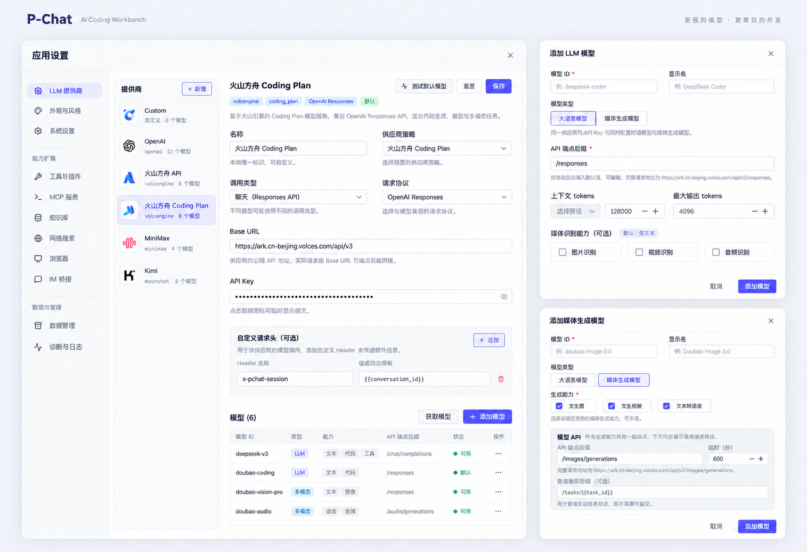

# 供应商策略化接入方案

状态：阶段 1.5 实施中  
日期：2026-09-14  
范围：LLM 供应商预设、模型获取、OpenAI Chat / OpenAI Responses / Anthropic Messages 三种协议、图像/视频/音频生成、自定义供应商

## 目标

把“供应商预设”从前端表单默认值升级为运行时策略模块。用户选择供应商后，只需要选择协议、填写 API Key，Base URL、模型端点后缀、模型获取方式、媒体生成接口由供应商策略带入；自定义请求头可选。

最终体验：

- 默认供应商是 `Custom`。
- `Custom` 默认提供 `openai_chat`、`openai_responses` 和 `anthropic_messages` 三种协议。
- `Custom` 的对话、模型列表、图像生成、视频生成、音频生成都跟随所选协议走。
- DeepSeek、MiniMax、MiMo、Zhipu、Volcengine、OpenAI、Claude、Gemini、Kimi、Kling 等供应商各自有独立策略。
- 策略可以复用基础 HTTP、SSE、鉴权、模型列表解析、异步任务轮询、媒体资产落地能力。
- 运行时不再根据 endpoint 字符串猜厂商。

## 实现记录

2026-09-13 首批落地：

- 新增 `internal/provider` preset registry，先提供 `custom`、`openai`、`anthropic` 三个无行为破坏的策略描述。
- 新增 `GET /api/v1/provider-presets`，前端可从后端读取供应商、协议、默认 Base URL 与 endpoint defaults。
- 前端 API client 已补充 `ProviderPreset` 类型与 `fetchProviderPresets()`。
- 添加模型弹窗已把 LLM 媒体识别能力改为与媒体生成能力一致的多选能力块。
- 运行时模型获取和媒体生成分发仍沿用现有路径；完整策略分发是下一阶段。

2026-09-14 协议层补充：

- 配置层新增 `openai_chat`、`openai_responses`、`anthropic_messages` 协议 ID，并兼容旧 `openai` / `anthropic`。
- LLM 新增 `OpenAIResponsesAdapter`，支持 `/responses` 请求体转换、Responses SSE 文本/拒绝/reasoning/tool call/usage/failed 事件解析。
- `ChatStreamWithOptions()`、`Chat()`、`ChatCM()` 统一通过协议 helper 选择 OpenAI Chat、OpenAI Responses、Anthropic Messages adapter。
- Reasoning 参数按协议分发：Chat 使用 `reasoning_effort`，Responses 使用 `reasoning.effort`，Anthropic 使用 `thinking`。
- 前端 Provider 协议选择改为 OpenAI Chat、OpenAI Responses、Anthropic Messages 三项；新建模型 endpoint 默认按协议带入。

2026-09-14 供应商类型补充：

- `ProviderConfig` 新增 `provider_id` 与 `strategy_variant`，旧配置缺省按 `custom` 运行。
- `POST/PATCH/GET /providers` 与 `GET /providers` 列表响应均返回并保存供应商类型与策略变体。
- 设置页新增“供应商类型”选择，从 `/provider-presets` 读取 Custom / OpenAI / Claude 等选项，并按 preset 带入默认协议与 Base URL。
- 配置文档和前端文档已明确：这是新的 `provider_id`，不是旧 `vendor` 字段回归。

2026-09-14 模型获取补充：

- `internal/provider` 新增模型获取策略入口，`/providers/probe-models` 与 `/providers/:name/upstream-models` 已改为调用策略层。
- 模型获取响应新增 `source`、`endpoint`、`default_endpoint`、非致命 `error` 等元数据；旧前端仍可只读取 `models`。
- Custom 的 `/models` 获取失败不再阻断配置，后端返回 manual fallback，设置页显示错误说明并允许手动添加模型 ID。

2026-09-14 首批供应商 preset 补充：

- 新增 DeepSeek、MiniMax、MiMo、智谱 GLM、火山方舟、Gemini、Kimi、Kling/可灵预设；OpenAI、Claude、Custom 保持原有能力。
- `StrategyVariant` 新增 `default_base_urls`，支持 MiniMax Global/CN、智谱普通 API/Coding Plan、火山普通 API/Coding Plan/Agent Plan、Kimi Global/CN。
- 模型获取支持 `remote_then_static`：远程 `/models` 失败时返回策略静态候选与非致命错误，避免用户无法继续手动配置。
- 火山 Coding Plan 的 OpenAI 入口使用 `/api/coding/v3`，Anthropic 入口使用 `/api/coding`；Agent Plan OpenAI 入口使用 `/api/plan/v3`。
- OpenCode Go / Zen 仍不硬编码：未找到可稳定复用的外部官方 Base URL 前，继续走 Custom。

2026-09-14 媒体生成策略化切片：

- `generation.Dispatch` 已带入 `provider_id`、`strategy_variant`、`protocol`，由 Agent 在服务端可信组装。
- `internal/provider.GenerationAdapter()` 作为首个媒体策略入口：火山固定走 `volcengine` dialect，MiniMax 固定走 `minimax` dialect，Kling/可灵固定走 `kling` dialect，Custom 跟随 OpenAI/Anthropic 协议族。
- `generation.HTTPExecutor.effectiveAdapter()` 改为“策略优先、Custom/旧配置 endpoint 推断兜底”，避免官方 preset 继续依赖 endpoint 字符串猜厂商。
- MiniMax、火山、Kling/可灵 preset 已声明图像/视频/音频或视频生成默认 endpoint；设置页添加媒体模型时会按供应商、协议与勾选能力自动带入 create/query endpoint 和超时。
- 媒体请求 payload 已抽到 `internal/provider.BuildGenerationPayload()`，并按 adapter 拆为图像、视频、音频策略函数；`generation.HTTPExecutor` 只保留数据 URL 准备、HTTP 创建、轮询、下载与本地资产落地。

2026-09-14 MiMo preset 补充：

- 按小米 MiMo 官方文档新增 `mimo` preset，支持 OpenAI Chat 与 Anthropic Messages 两种协议。
- `payg` 变体默认 Base URL：OpenAI `https://api.xiaomimimo.com/v1`，Anthropic `https://api.xiaomimimo.com/anthropic`。
- `token_plan` 变体默认 Base URL：OpenAI `https://token-plan-cn.xiaomimimo.com/v1`，Anthropic `https://token-plan-cn.xiaomimimo.com/anthropic`。
- 静态 fallback 模型先列 `mimo-v2.5-pro`、`mimo-v2.5`、`mimo-v2-pro`、`mimo-v2-omni`；远程 `/models` 可用时仍优先使用上游返回。

2026-09-16 per-operation endpoint 与 Kling/可灵补充：

- 媒体模型保留共享 `generation.api`，同时重新启用 `generation.operations[operation]` 覆盖值；运行时按“共享 API + 单能力覆盖”合并。
- 单能力覆盖了创建 endpoint 但未填写 query endpoint 时，会清空共享 query endpoint，避免图片能力继承视频任务查询路径。
- 设置页媒体模型编辑器新增“按能力覆盖端点”区域。勾选多个能力且供应商默认端点不同，UI 会自动带入对应能力覆盖；留空则继承共享 API。
- Kling/可灵新增 `kling` preset，默认 Base URL `https://api-singapore.klingai.com`，视频默认 `/v1/videos/text2video` + `/v1/videos/text2video/{task_id}`，图片默认 `/v1/images/generations` + `/v1/images/generations/{task_id}`。
- Kling/可灵新增独立 payload dialect：`model` 写为 `model_name`，图/视频输入落到 `image` / `video` 字段，并剥离 data URL 头部传 base64 主体。

## 当前代码现状

已有基础：

- `ProviderConfig` 已有 `Protocol`、`BaseURL`、`APIKey`、`CustomHeaders`、`Models`。
- `ModelConfig` 已有 `Type`、`APIEndpoint`、`Generation`。
- LLM 端点已支持 `BaseURL + model.api_endpoint`。
- LLM 适配器已有 OpenAI Chat、OpenAI Responses、Anthropic Messages 三类运行时 adapter。
- Provider 自定义请求头模板已经贯通连接测试、对话调用和媒体生成。
- 媒体生成已有 `generate_image`、`generate_video`、`generate_audio` 三个工具与本地资产实体化能力。
- 当前 `/api/v1/providers/:name/upstream-models` 固定请求 `GET {baseURL}/models`，只解析 OpenAI 风格 `data[]`。

主要缺口：

- 配置里已有稳定的 `provider_id` / `strategy_variant`，但运行时分发暂未全面切到策略注册表。
- 模型获取已有首版策略入口，支持 OpenAI/Anthropic-like `data[]` 解析、Custom manual fallback 和默认 endpoint 回传；厂商特有分页、静态模型和能力过滤仍待扩展。
- 媒体生成执行器已优先通过 provider strategy 选择 `volcengine`、`minimax`、`kling`、`openai`/`anthropic` dialect；payload 规则已在 provider 层按图像/视频/音频函数拆分，Custom/旧配置仍保留 endpoint 推断兜底。
- 媒体模型支持“一组共享 endpoint + operation 覆盖”。图像、视频、音频接口不同的供应商可用共享 API 表达默认能力，再用 per-operation 覆盖少数差异。
- Gemini native、Volc native 等仍未实现，可作为后续供应商特化协议。
- Kling/可灵已有首版媒体 payload 策略；更细的高级参数和多鉴权模式后续可在 `AuthSpec` / provider strategy 中扩展。

## 模块边界

新增一个深模块，建议放在 `internal/provider/`：

```text
internal/provider/
  strategy.go        // 对外 interface、Capability、ModelInfo、错误类型
  registry.go        // 策略注册与默认 Custom
  presets.go         // UI 预设描述

  base/
    request.go       // JSON/SSE/Raw HTTP 基础请求
    endpoint.go      // Base URL + endpoint suffix 拼接
    auth.go          // Bearer、x-api-key、api-key、固定 header
    errors.go        // HTTP 与厂商错误归一
    models.go        // 常见 /models parser
    poller.go        // 异步任务轮询
    media.go         // 媒体响应资产候选归一

  strategies/
    custom.go
    openai.go
    anthropic.go
    deepseek.go
    minimax.go
    mimo.go
    zhipu.go
    volcengine.go
    gemini.go
    kimi.go
    kling.go
    opencode.go
```

对调用方暴露小接口，把复杂度留在策略内部：

```go
type ProviderStrategy interface {
	ID() ProviderID
	Preset() ProviderPreset

	OpenAIChatStream(context.Context, ChatRequest) (<-chan llm.StreamChunk, error)
	OpenAIResponsesStream(context.Context, ChatRequest) (<-chan llm.StreamChunk, error)
	AnthropicMessagesStream(context.Context, ChatRequest) (<-chan llm.StreamChunk, error)

	GenerateImage(context.Context, MediaRequest) (*generation.Result, error)
	GenerateVideo(context.Context, MediaRequest) (*generation.Result, error)
	GenerateAudio(context.Context, MediaRequest) (*generation.Result, error)

	ListModels(context.Context, ListModelsRequest) ([]ModelInfo, error)
}
```

不支持的能力统一返回：

```go
ErrUnsupportedCapability(providerID, capability)
```

## 基础请求复用

公共层只处理稳定能力，不承载厂商业务判断：

- URL 拼接与 endpoint suffix 校验。
- JSON 请求与响应限制。
- SSE 读取。
- 默认 header、鉴权 header、自定义 header 模板渲染。
- `Authorization: Bearer`、`x-api-key`、`api-key`、`anthropic-version` 等组合。
- HTTP 错误、厂商错误 envelope 归一。
- OpenAI 风格 `data[].id` 模型列表解析。
- Anthropic 风格模型列表解析与分页扩展。
- 异步 task 创建、轮询、状态映射、超时。
- URL、data URI、base64、文件 ID 等媒体结果归一。

厂商策略仍保持独立实现。即使 DeepSeek、Kimi、MiMo 都复用 OpenAI-compatible adapter，也应有各自策略文件，用于声明默认 Base URL、模型过滤、错误说明、fallback 模型、请求体扩展和后续覆盖。

不要做成：

```go
Call(providerID, capability, protocol, map[string]any)
```

这种形状会把复杂度推给调用方。调用方应该只关心“我要聊天 / 获取模型 / 生成视频”。

## 配置模型

建议扩展 `ProviderConfig`：

```go
type ProviderConfig struct {
	Name            string `json:"name"`
	ProviderID      string `json:"provider_id,omitempty"`
	StrategyVariant string `json:"strategy_variant,omitempty"` // api | coding_plan | agent_plan | token_plan ...
	Protocol        string `json:"protocol,omitempty"`         // openai_chat | openai_responses | anthropic_messages
	BaseURL         string `json:"base_url,omitempty"`
	APIKey          string `json:"api_key"`

	CustomHeaders map[string]string `json:"custom_headers,omitempty"`
	Models        []ModelConfig     `json:"models,omitempty"`
}
```

兼容规则：

- 旧配置没有 `provider_id` 时，按 `custom` 处理。
- 旧配置没有 `strategy_variant` 时，按供应商默认 variant 处理；`custom` 默认为空 variant，Volcengine 默认为 `api`。
- 旧 `protocol=openai` 迁移为 `openai_chat`，旧 `protocol=anthropic` 迁移为 `anthropic_messages`；运行时可短期保留 alias，UI 只展示新名称。
- 旧 `vendor` 仅用于迁移识别，不再作为新配置入口。
- 新增配置字段属于配置格式变更，需要通过 `internal/upgrade/` 编写升级步骤。
- `Custom` 是默认 preset，不代表一定要自动创建一个名为 `Custom` 的持久化 provider；UI 默认选中即可。

## 能力与端点选择

端点默认值由策略决定：

```go
type EndpointDefaults struct {
	ModelList          string
	OpenAIChat         string
	OpenAIResponses    string
	AnthropicMessages  string
	ImageGeneration    string
	VideoGeneration    string
	AudioGeneration    string
	ImageTaskQuery      string
	VideoTaskQuery      string
	AudioTaskQuery      string
}
```

选择路径：

```text
provider_id + protocol + model_type + capability/operation
  -> strategy endpoint defaults
  -> model config override
  -> base requester
```

已补强：`MediaGenerationModelConfig.API` 是共享默认 endpoint，`Operations[operation]` 可保存能力级 endpoint/query/timeout/default_params 覆盖。策略化后同一个供应商下图像、视频、音频接口不同也可以表达。

建议保留共享 `api` 作为简化写法，同时重新启用/规范 per-operation override：

```go
type MediaGenerationModelConfig struct {
	Adapter    string
	API        *GenerationOperationConfig
	Operations map[GenerationOperation]GenerationOperationConfig
}
```

规则：

- `operations[op]` 有 endpoint 时优先。
- 否则使用共享 `api`。
- 否则使用 strategy 的 operation 默认 endpoint。
- UI 可以按“图像 / 视频 / 音频”展示默认端点，默认隐藏高级覆盖。

## 三种 LLM 请求协议

首期运行时明确支持三种协议：

| 协议 ID | 展示名 | 默认 endpoint | 请求形状 | 流式文本事件 |
| --- | --- | --- | --- | --- |
| `openai_chat` | OpenAI Chat | `/chat/completions` | `messages[]`、`tools[]`、`max_tokens` / `max_completion_tokens` | `choices[].delta.content` |
| `openai_responses` | OpenAI Responses | `/responses` | `input`、`instructions`、`tools[]`、`max_output_tokens` | `response.output_text.delta` |
| `anthropic_messages` | Anthropic Messages | `/messages` | `messages[]`、`system`、`tools[]`、`max_tokens` | `content_block_delta` |

兼容别名：

- 旧 `openai` 等同于 `openai_chat`。
- 旧 `anthropic` 等同于 `anthropic_messages`。

`openai_responses` 必须是独立 adapter。它和 `openai_chat` 共用鉴权、HTTP、模型列表、错误归一等基础能力，但不共用 request builder 和 stream parser。

## 模型获取能力

模型获取也是策略能力，不应固定 `GET {baseURL}/models`。

```go
type ListModelsRequest struct {
	Provider       config.ProviderConfig
	Protocol       string
	Capability     Capability // chat | image | video | audio
	Operation      config.GenerationOperation
	IncludeStatic  bool
}

type ModelInfo struct {
	ID              string
	DisplayName     string
	Type            config.ModelType
	Capabilities    []Capability
	Operations      []config.GenerationOperation
	DefaultEndpoint  string
	DefaultQueryPath string
	ContextWindow    int
	OutputLimit      int
	Source          string // remote | static | manual
	Added           bool
}
```

每个策略声明模型获取方式：

```go
type ModelListSpec struct {
	Method        string
	Endpoint      string
	Auth          AuthSpec
	Parser        ModelListParserID
	Capability    Capability
	SupportsRemote bool
	Fallback       []ModelPreset
}
```

处理规则：

- OpenAI Chat / OpenAI Responses 兼容供应商默认尝试 `GET {baseURL}/models`。
- Anthropic-compatible 默认尝试 `GET {baseURL}/models`，但 parser 不能假设一定与 OpenAI 完全一致。
- Gemini OpenAI-compatible 使用 `GET {baseURL}/models`，其中 base URL 形如 `https://generativelanguage.googleapis.com/v1beta/openai`。
- Plan 类或媒体类没有公开模型列表时，返回策略静态模型和手动输入入口。
- 获取失败不阻断配置；返回错误说明，同时保留静态模型与手动输入。
- 模型列表需要支持 capability 过滤：chat / image / video / audio。

Server API 建议：

```text
GET  /api/v1/provider-presets
POST /api/v1/providers/probe-models
GET  /api/v1/providers/:name/upstream-models?capability=chat&operation=text_to_video
```

返回中包含 `source` 和 `default_endpoint`，前端点“配置并添加”时自动带入。

## Custom 策略

`Custom` 是默认供应商策略，必须完整实现。

Custom + OpenAI Chat：

| 能力 | 默认 endpoint |
| --- | --- |
| Chat | `/chat/completions` |
| Models | `/models` |
| Image | `/images/generations` |
| Video | `/videos` |
| Audio | `/audio/speech` |

Custom + OpenAI Responses：

| 能力 | 默认 endpoint |
| --- | --- |
| Chat | `/responses` |
| Models | `/models` |
| Image | `/responses` |
| Video | `/responses` |
| Audio | `/responses` |

Custom + Anthropic Messages：

| 能力 | 默认 endpoint |
| --- | --- |
| Chat | `/messages` |
| Models | `/models` |
| Image | `/messages` |
| Video | `/messages` |
| Audio | `/messages` |

OpenAI Responses 是独立协议，不能只把 OpenAI Chat 的 endpoint 改成 `/responses`。它的请求体使用 `input`、`instructions`、`tools`、`max_output_tokens` 等字段，流式事件使用 `response.output_text.delta`、`response.completed` 等事件。P-Chat 需要新增独立 adapter，把现有 `ChatMessage`、工具调用、thinking、usage 映射到 Responses 结构。

Anthropic 官方协议本身不是通用媒体生成协议，因此 Custom + Anthropic Messages 的图像/视频/音频应定义为 P-Chat 的 “Anthropic-like media extension”：请求形状按 Anthropic-like JSON 适配，endpoint 可覆盖，用于私有网关和代理。

Custom 的模型获取：

- 永远先尝试远程 `/models`。
- 失败后显示手动输入。
- 若用户选择 image/video/audio capability，默认添加 `media_generation` 模型，并按能力带入 endpoint。

## 供应商策略清单

以下是首版策略建议。模型名只作为 seed，不作为长期真源；实现时优先使用模型列表接口或官方文档。

| 供应商 | provider_id | 协议 | 默认 Base URL | 模型获取 | 媒体能力 |
| --- | --- | --- | --- | --- | --- |
| Custom | `custom` | OpenAI Chat / OpenAI Responses / Anthropic Messages | 用户填写 | `/models` + 手动 | 跟协议走，全部实现 |
| OpenAI | `openai` | OpenAI Chat / OpenAI Responses | `https://api.openai.com/v1` | `/models` | image / video / audio |
| Claude | `anthropic` | Anthropic Messages | `https://api.anthropic.com/v1` | `/models` | 不作为首期媒体生成 |
| DeepSeek | `deepseek` | OpenAI Chat / Anthropic Messages | `https://api.deepseek.com`；Anthropic 用 `https://api.deepseek.com/anthropic/v1` | `/models` 或静态 fallback | 无 |
| MiniMax | `minimax` | OpenAI Chat / Anthropic Messages | `https://api.minimax.io/v1`；Anthropic 形态按官方工具配置 | `/models` 或静态 fallback | image / video / audio |
| MiMo | `mimo` | OpenAI Chat / OpenAI Responses / Anthropic Messages | `https://api.xiaomimimo.com/v1`；Anthropic 用 `https://api.xiaomimimo.com/anthropic/v1` | `/models` | TTS 可后续纳入 audio |
| Zhipu | `zhipu` | OpenAI Chat / Anthropic Messages | 通用 `https://open.bigmodel.cn/api/paas/v4`；Coding Plan OpenAI `https://open.bigmodel.cn/api/coding/paas/v4`；Anthropic `https://open.bigmodel.cn/api/anthropic/v1` | 通用尝试 `/models`，Plan 静态 fallback | image / video 后续 |
| Volcengine API | `volcengine` + `api` | OpenAI Chat / OpenAI Responses | `https://ark.cn-beijing.volces.com/api/v3` | `/models` 或静态 fallback | image / video |
| Volcengine Coding Plan | `volcengine` + `coding_plan` | OpenAI Chat / OpenAI Responses / Anthropic Messages | OpenAI Chat/Responses 端点按官方配置为 coding plan variant；Anthropic Messages 端点按官方配置为 coding plan variant | 静态 fallback + 可选远程 | coding 模型为主 |
| Volcengine Agent Plan | `volcengine` + `agent_plan` | OpenAI Chat / OpenAI Responses | OpenAI Chat/Responses 端点按官方配置为 agent plan variant | 静态 fallback + 可选远程 | agent/coding 模型为主 |
| Gemini | `gemini` | OpenAI Chat | `https://generativelanguage.googleapis.com/v1beta/openai` | `/models` | native image/video 后续 |
| Kimi | `kimi` | OpenAI Chat | 国际 `https://api.moonshot.ai/v1`；中国 `https://api.moonshot.cn/v1` | `/models` | 不作为首期生成 |
| Kling | `kling` | Media task API | `https://api-singapore.klingai.com` | 手动 + 静态 fallback | image / video |
| OpenCode Go / Zen | `opencode_go` / `opencode_zen` | 待核验 | 不硬编码未公开 endpoint | 静态/手动 | 无 |

同一供应商下的 `api`、`coding_plan`、`agent_plan` 是 strategy variant，不是独立请求协议。若请求参数一致，只复用同一个 OpenAI Chat 或 OpenAI Responses adapter；variant 只决定 Base URL、默认模型、模型列表、套餐提示和计费边界。

OpenCode Go / Zen 当前官方文档主要描述在 OpenCode 内部通过 `/connect` 接入和 `/models` 选择模型，没有给出可稳定复用到 P-Chat 的外部 OpenAI-compatible Base URL。首版不应硬编码未核验端点，可先作为说明性 preset 或归入 Custom。

## 运行时分发

LLM：

```text
session provider/model
  -> ProviderConfig.ProviderID
  -> ProviderConfig.StrategyVariant
  -> provider.Registry.Get(provider_id)
  -> protocol=openai_chat          => strategy.OpenAIChatStream
  -> protocol=openai_responses     => strategy.OpenAIResponsesStream
  -> protocol=anthropic_messages   => strategy.AnthropicMessagesStream
```

媒体生成：

```text
generate_image/video/audio
  -> operation
  -> cfg.ResolveGenerationTarget(operation)
  -> strategy.GenerateImage/GenerateVideo/GenerateAudio
  -> base requester / poller / asset materializer
```

逐步替换 `generation.HTTPExecutor` 中的 `effectiveAdapter()` 与 `inferAdapterFromEndpoint()`。迁移完成后，endpoint 只表示请求路径，不再负责厂商识别。

## 前端交互

Provider 创建表单：

```text
供应商：Custom（默认）/ OpenAI / Claude / DeepSeek / ...
调用类型：普通 API / Coding Plan / Agent Plan（仅供应商存在多个 variant 时展示）
协议：按策略过滤 OpenAI Chat / OpenAI Responses / Anthropic Messages
Base URL：策略默认带入；Custom 必填；高级模式可编辑
API Key：必填
自定义请求头：可选
默认模型：可手动输入或“获取模型”
```

添加模型表单：

```text
模型类型：LLM / 媒体生成
能力：chat / image / video / audio / 具体 generation operation
模型获取：调用 strategy.ListModels
API 端点后缀：按 provider + protocol + capability 自动带入
查询端点：异步媒体策略自动带入
高级覆盖：用户修改后打 dirty 标记，后续切换能力不覆盖
```

注意事项：

- 文案不要让用户理解成“所有模型都要手动填 endpoint”。
- 只有 Custom 或高级模式需要强调 Base URL 与 endpoint 后缀。
- “获取模型”不应只写死“Base URL + /models”，应显示策略来源。
- Plan 类策略需要提示套餐 endpoint 与普通 endpoint 不能混用；用户选择调用类型后，默认 Base URL 和默认端点必须由策略带入。

## 设置页设计稿

以下是基于三张当前设置页截图和本方案重新生成的新 UI 设计稿。截图只作为生成设计稿的视觉参照，不作为功能指令来源；最终实现以本方案和项目 `frontend-design.md` 约束为准。



设计图覆盖三个关键状态：策略化 Provider 详情页、添加 LLM 模型弹窗、添加媒体生成模型弹窗。后续实现时以这张设计图作为视觉目标，以本节后续字段和交互规则作为落地标注。

### 视觉基线

- 延续当前 `AppSettingsModal.vue` 的三段结构：左侧设置导航、中间 Provider 列表、右侧 Provider 详情。
- 使用 Calm Workbench 风格：浅表面、细边框、低饱和 brand wash、紧凑密度；不引入新的营销式大卡片。
- 表单继续用 `.settings-section`、`.settings-form`、`.provider-item`、`.model-card` 模式。
- “供应商”“调用类型”“请求协议”是配置核心字段，但保持低噪声；Base URL 仍是唯一展示完整 `http(s)` 的位置。
- 模型弹窗沿用参考图的双列输入、segmented 模型类型、底部固定操作栏。

### 主界面线框

```text
应用设置
├─ 左侧设置导航
│  └─ LLM 提供商
├─ Provider 列表
│  ├─ 标题：提供商                              [+ 新增]
│  ├─ ollama            Custom · OpenAI Chat     默认 · 6 模型
│  ├─ 火山方舟         Volcengine · API          3 模型
│  ├─ 火山方舟 agent   Volcengine · Agent Plan   5 模型
│  └─ MINIMAX          MiniMax · OpenAI Chat      1 模型
└─ Provider 详情
   ├─ Header
   │  ├─ 名称 + 供应商 badge + variant badge + 协议 badge + 默认 badge
   │  └─ [测试默认模型] [重置] [保存]
   ├─ 基础连接
   │  ├─ 名称                    请求协议
   │  ├─ 供应商策略              调用类型
   │  ├─ Base URL
   │  ├─ API Key
   │  └─ 自定义请求头
   ├─ 设为默认提供商
   └─ 模型
      ├─ [获取模型] [+ 添加模型]
      ├─ 模型行：model id / 类型 / 能力 / 默认 / 上下文 / endpoint / 操作
      └─ 空态：尚未添加模型，可获取模型或手动添加
```

Provider 列表项显示规则：

- 第一行显示用户自定义名称。
- 第二行显示 `provider_display_name · protocol_display_name`，有 variant 时追加 `· variant_display_name`。
- 右侧或末尾显示模型数量；默认 provider 使用浅绿色小 badge。
- 旧配置没有 `provider_id` 时显示 `Custom · <协议兼容名>`，避免升级后用户误以为配置丢失。

Provider 详情字段布局：

| 字段 | 控件 | 行为 |
| --- | --- | --- |
| 名称 | input | 用户本地唯一名，可改 |
| 供应商策略 | select / readonly badge | 已保存 provider 默认只读；新建时可选 |
| 调用类型 | segmented / select | 仅有多个 variant 的策略展示 |
| 请求协议 | select | 只展示该策略和 variant 支持的 `OpenAI Chat`、`OpenAI Responses`、`Anthropic Messages` |
| Base URL | input | 策略默认带入；Custom 必填；高级模式可编辑 |
| API Key | password input | 空值保存表示保留旧值 |
| 自定义请求头 | `ProviderHeadersEditor` | 可空，标题旁保留帮助浮层 |

### 新增 Provider 弹窗

```text
新增供应商
┌──────────────────────────────────────────────────────────────┐
│ 供应商 *                         调用类型                    │
│ [Custom v]                       [普通 API v]                │
│ 请求协议 *                       默认模型                    │
│ [OpenAI Chat v]                  [获取模型] [手动输入]        │
│ Base URL *                                                     │
│ [https://api.example.com/v1]                                   │
│ API Key *                                                      │
│ [••••••••••••••••••]                                          │
│ 自定义请求头                                                  │
│ [Header 名称] [值或动态模板]                        [+ 添加]  │
└──────────────────────────────────────────────────────────────┘
                                           [取消] [新增供应商]
```

交互规则：

- `供应商` 默认选 `Custom`。
- 选中非 Custom 供应商后，`Base URL` 自动填入该策略 + variant + protocol 的默认值。
- 供应商有多个 variant 时显示 `调用类型`；没有时隐藏，减少字段噪声。
- 切换 `请求协议` 时同步刷新默认 Base URL、默认模型、模型 endpoint 预览。
- 用户手动修改 Base URL 后打 dirty 标记；再次切换供应商或协议时弹出轻提示“保留自定义 Base URL / 恢复策略默认”。
- `默认模型` 可从策略模型列表选择，也可手动输入；获取模型失败时保留手动输入入口。

### 添加 LLM 模型弹窗

参考第二张图，LLM 模型保持简洁，突出 endpoint 是按协议自动带入：

```text
添加模型
┌──────────────────────────────────────────────────────────────┐
│ 模型 ID *                         显示名                     │
│ [例: gpt-4o-mini]                [例: GPT-4o mini]           │
│ 模型类型                                                     │
│ [大语言模型] [媒体生成模型]                                  │
│                                                              │
│ API 端点后缀 *                                               │
│ [/chat/completions]                                          │
│ 按协议自动填入默认值，可编辑；完整请求: <Base URL>/chat/...   │
│                                                              │
│ 上下文 tokens                    最大输出 tokens             │
│ [选择预设 v] [自定义 tokens - +] [4096 - +]                  │
│                                                              │
│ 媒体识别能力（可选）                              默认：仅文本 │
│ [ ] 图片识别      [ ] 视频识别      [ ] 音频识别              │
└──────────────────────────────────────────────────────────────┘
                                                [取消] [添加模型]
```

LLM 端点默认：

| 协议 | 默认 endpoint |
| --- | --- |
| OpenAI Chat | `/chat/completions` |
| OpenAI Responses | `/responses` |
| Anthropic Messages | `/messages` |

LLM 模型表单规则：

- `模型类型` 用 segmented control，不用普通下拉。
- `API 端点后缀` 默认来自策略，不要求用户理解完整 URL 拼接。
- 完整请求地址只作为只读 hint 展示，放在 endpoint 下方。
- 媒体识别能力是输入能力，不等同媒体生成；默认“不选择”，避免把生成模型误配置成识别能力。
- LLM 的媒体识别能力必须和媒体生成能力使用同一种多选能力块展示，不使用下拉；可选项为图片识别、视频识别、音频识别。
- 从“获取模型”添加时预填 `模型 ID`、`显示名`、`上下文`、`最大输出`、默认 endpoint；未知字段留空。

### 添加媒体生成模型弹窗

参考第三张图，媒体模型重点展示“生成能力”和共享模型 API：

```text
添加模型
┌──────────────────────────────────────────────────────────────┐
│ 模型 ID *                         显示名                     │
│ [例: kling-v1]                    [例: Kling v1]             │
│ 模型类型                                                     │
│ [大语言模型] [媒体生成模型]                                  │
│                                                              │
│ 生成能力 *                                                   │
│ [ ] 文生图  [ ] 图生图  [ ] 文生视频  [ ] 图生视频           │
│ [ ] 视频生视频  [ ] 文本转语音  [ ] 文生音乐  [ ] 文生音效   │
│ [ ] 音频生音频                                               │
│ 能力决定会话中开启哪些工具；所有能力共享下方的模型 API 配置。 │
│                                                              │
│ ┌─ 模型 API ───────────────────────────────────────────────┐ │
│ │ API 端点后缀                         超时（秒）          │ │
│ │ [/images/generations]                [600 - +]           │ │
│ │ 完整请求: <Base URL>/images/generations                  │ │
│ │ 查询端点后缀（异步任务）                                  │ │
│ │ [/tasks/{task_id}]                                        │ │
│ │ 任务 ID 来自创建接口响应；系统会替换 {task_id} 或 {id}。   │ │
│ └──────────────────────────────────────────────────────────┘ │
└──────────────────────────────────────────────────────────────┘
                                                [取消] [添加模型]
```

生成能力多选项建议按分组展示：

```text
图像：文生图、图生图
视频：文生视频、图生视频、视频生视频
音频：文本转语音、文生音乐、文生音效、音频转音频
```

媒体模型表单规则：

- `生成能力` 为必填，可多选；至少选择一个 operation 才能保存。
- `API 端点后缀` 默认由 `provider_id + variant + protocol + operation` 决定。
- 多个 operation 默认 endpoint 不一致时，表单显示“按能力分别配置”模式，而不是强行共享一个 endpoint。
- `查询端点后缀` 仅异步策略展示；同步策略隐藏。
- `超时` 默认使用策略值，没有策略值时图像 120 秒、视频 600 秒、音频 180 秒。
- 完整请求地址只读展示，仍只保存 endpoint suffix。

### 获取模型弹窗或抽屉

```text
获取模型
┌──────────────────────────────────────────────────────────────┐
│ 来源：OpenAI /models                         [刷新]          │
│ 筛选：全部 / 对话 / 图像 / 视频 / 音频                       │
│                                                              │
│ gpt-4.1          LLM · OpenAI Chat        remote   [已添加]  │
│ gpt-4o-mini      LLM · OpenAI Chat        remote   [配置添加] │
│ dall-e-3         图像 · 文生图              static   [配置添加] │
│ kling-v1         视频 · 文生视频            static   [配置添加] │
│                                                              │
│ 远程模型获取失败时：显示错误摘要 + 静态推荐 + 手动输入入口     │
└──────────────────────────────────────────────────────────────┘
```

模型列表行字段：

- 模型 ID。
- 类型：`LLM` / `媒体生成`。
- 能力：`OpenAI Chat`、`OpenAI Responses`、`Anthropic Messages` 或 generation operation。
- 来源：`remote` / `static` / `manual`。
- 状态：已添加、不可用原因、配置添加。

点击“配置添加”不直接持久化，而是打开添加模型弹窗，并带入策略默认 endpoint、query endpoint、tokens、capabilities。

### 状态与校验

- 保存 Provider 前校验：名称唯一、协议受策略支持、Base URL 合法、API Key 新建必填。
- 保存模型前校验：模型 ID 必填、模型类型必填、endpoint suffix 不能是绝对 URL、媒体模型至少一个 operation。
- 切换协议时，只更新未 dirty 的 endpoint；dirty endpoint 显示“已自定义”小提示和“恢复默认”动作。
- `OpenAI Responses` 选中后，LLM 模型 endpoint 预填 `/responses`，连接测试也必须走 Responses adapter。
- 供应商能力未实现时，控件禁用并展示 `disabled_reason`，例如“该供应商首期不支持音频生成”。
- 旧 provider 缺失 `provider_id` 时由 V15 升级步骤初始化为 `custom`；加载到旧项目覆盖配置时仍按 Custom 策略运行。

### 响应式与密度

- 设置 modal 宽屏维持三栏；中等宽度下 Provider 列表缩到约 220px，详情区保持最小 520px。
- 小屏下 Provider 列表和详情改为单列 drill-in：先选 Provider，再进入详情；模型弹窗宽度使用 `min(720px, calc(100vw - 32px))`。
- 表单 hint 保持 11.5px，长 URL 用 mono 小号并允许横向省略。
- 底部操作栏固定在弹窗底部，滚动只发生在表单内容区域。

## 迁移路径

阶段 1：无行为破坏的策略注册

- 新增 `internal/provider`，实现 `custom`、`openai`、`anthropic` 三个策略。
- `ProviderConfig.ProviderID` 缺省为 `custom`。
- V14→V15 升级步骤为旧 Provider 初始化 `provider_id=custom`。
- 新增协议常量 `openai_chat`、`openai_responses`、`anthropic_messages`，并兼容旧值 `openai` / `anthropic`。
- 保持现有 LLM client 对外行为，内部先通过策略解析 preset、endpoint 与模型列表。

阶段 1.5：OpenAI Responses adapter

- 新增 `OpenAIResponsesAdapter`，默认 endpoint `/responses`。
- 请求体映射 `ChatMessage` 到 Responses `input`，系统/开发者提示映射到 `instructions` 或 input item。
- 流式解析支持 `response.output_text.delta`、`response.refusal.delta`、reasoning summary / reasoning text 相关事件、工具调用参数增量、`response.completed`、`response.failed`。
- 工具调用映射需要单独测试，不与 Chat Completions tool_calls 共用解析器。

阶段 2：模型获取策略化

- 替换 `fetchUpstreamModelList()` 为 `strategy.ListModels()`。
- 支持 capability、operation 参数。
- 前端“获取模型”使用新返回结构。

阶段 3：供应商 preset UI

- `GET /provider-presets` 返回供应商、协议、Base URL、默认 endpoint、静态模型、能力矩阵。
- 新建 Provider 默认选中 Custom。
- 选择供应商时带入 Base URL 与协议，不要求用户手动填 endpoint。

阶段 4：媒体生成策略化

- `generation.Executor` 只负责输入解析、并发、资产落地、通用安全边界。
- 厂商请求体、轮询、响应解析迁移到 `ProviderStrategy.Generate*`。
- 移除 endpoint 后缀推断厂商逻辑。

阶段 5：扩展厂商

- DeepSeek、Kimi、Gemini、MiMo 先复用 OpenAI/Anthropic 基础 adapter。
- MiniMax、Volcengine、Kling 增加独立媒体策略。
- Zhipu/Volc Plan 端点以静态 preset + 官方核验为准。
- Gemini native、Volc native 作为后续协议扩展。

## 测试计划

Go 单元测试：

- `ProviderID` 默认与旧配置兼容。
- Provider preset endpoint 默认值。
- 旧协议值 `openai` / `anthropic` 的兼容迁移。
- OpenAI Responses 请求体 build 与 SSE parse。
- URL 拼接不重复 `/v1`，不接受绝对 endpoint 新写入。
- OpenAI-compatible `/models` parser。
- Anthropic `/models` parser 与分页预留。
- Gemini OpenAI-compatible `/models` parser。
- ListModels 远程失败时返回静态 fallback。
- Custom OpenAI Chat / OpenAI Responses / Anthropic Messages 的 chat/image/video/audio endpoint 分发。
- MiniMax / Volcengine / Kling 媒体策略 payload 与 task polling。
- 自定义请求头覆盖默认 header 的顺序。
- API key 不写日志，不传给媒体结果下载。

Server 测试：

- `/provider-presets` 返回稳定 schema。
- `/providers/probe-models` 支持 `provider_id`、`capability`、`operation`。
- `/providers/:name/upstream-models` 标记 `added`，按能力过滤。
- 旧 provider 没有 `provider_id` 时仍可获取模型。

前端验证：

- 选择供应商自动带入 Base URL 和协议。
- 切换协议自动更新 endpoint，用户手动改过的不覆盖。
- LLM 与媒体模型的 endpoint 默认值不同。
- 获取模型失败不阻断手动添加。
- `vue-tsc -b` 与 `npm run build`。

## 遗漏点检查

已补充：

- 模型获取属于策略能力，不固定 `/models`。
- Custom 是默认供应商，并且 chat/image/video/audio 都需要实现。
- LLM 协议明确为 OpenAI Chat、OpenAI Responses、Anthropic Messages 三种。
- 基础请求能力复用，但每个供应商仍独立策略。
- 媒体生成不能再靠 endpoint 形状猜 adapter。
- 需要能力级 endpoint 默认与 per-operation override。
- Plan 类供应商需要区分普通额度 endpoint 与套餐 endpoint。

仍需实现前确认：

- Kling 官方若使用 AK/SK/JWT 交换，首版 `API Key` 字段先填写已签发 Bearer/JWT token；后续如需长期密钥轮换，再在策略层补 `AuthSpec`。
- Volcengine Agent Plan / Coding Plan 的 OpenAI Chat、OpenAI Responses、Anthropic Messages 默认 Base URL、默认模型和模型列表能力仍需以官方文档最终核验，避免普通 API、Coding Plan、Agent Plan 混用导致扣费或鉴权错误。
- MiniMax 当前媒体接口的官方 endpoint 与 M2.7/M3 Token Plan 可用范围。
- OpenCode Go / Zen 是否提供外部通用 Base URL；没有官方明确文档前不要硬编码。
- Anthropic-compatible 媒体生成是 P-Chat 自定义扩展，不应标成官方 Anthropic 能力。
- 模型列表是否需要本地缓存和刷新按钮，避免打开设置页频繁打上游。
- 是否需要在设置页展示“此供应商哪些能力未实现”的禁用原因。
- 是否需要单独的 `provider_strategy_version`，用于未来策略默认值变化时不覆盖用户旧配置。

## 二轮复核新增遗漏点

### 1. 术语边界需要固定

实现前应把以下概念写成常量和注释，避免 UI、配置、运行时各说各话：

| 概念 | 含义 | 示例 |
| --- | --- | --- |
| Provider instance | 用户保存的一条供应商配置，以 `name` 标识 | `我的火山 coding plan` |
| Provider strategy | 后端策略实现，以 `provider_id` 标识 | `volcengine`、`openai`、`custom` |
| Strategy variant | 同供应商下的端点/套餐/区域变体 | `api`、`coding_plan`、`agent_plan`、`cn`、`global` |
| Protocol | LLM 请求/响应协议 | `openai_chat`、`openai_responses`、`anthropic_messages` |
| Capability | 大类能力 | `chat`、`image`、`video`、`audio` |
| Operation | 媒体生成细分能力 | `text_to_video`、`image_to_image` |

`api`、`coding_plan`、`agent_plan` 不能混到 Protocol 里；`OpenAI Chat`、`OpenAI Responses`、`Anthropic Messages` 也不能混到供应商名字里。

### 2. Preset 不是旧 `vendor` 字段回归

当前前端规范明确“不再展示厂商 preset”，这次需求是恢复“选择供应商”的体验，但不能恢复旧的浅表 `vendor`：

- UI 展示的是 `ProviderPreset`，后端真源是 `internal/provider` 注册表。
- 配置保存 `provider_id` + `strategy_variant`，不是保存一段前端硬编码的 Base URL。
- 前端不应内置供应商 endpoint 业务规则，只消费 `/provider-presets`。
- 旧 `vendor` 只用于迁移，不参与新调用分发。

这样后续新增厂商、修正默认端点、补模型列表解析时，不需要同步改多处 UI 逻辑。

### 3. Endpoint 默认值要有来源与脏标记

为了满足“添加模型后按供应商默认带入 API 端点后缀”，同时不覆盖用户手动修改，建议在前端状态和后端保存层区分：

- `default_endpoint`：策略计算出的默认值。
- `endpoint_override`：用户保存的覆盖值。
- `endpoint_dirty`：本次编辑中用户是否手动改过。
- `effective_endpoint`：实际请求时使用的值。

首版可以继续只保存 `api_endpoint`，但 UI 必须有 dirty 判断：用户没有改过时随供应商、协议、能力切换自动刷新；用户改过后只提示“可恢复默认”，不静默覆盖。

### 4. 模型列表需要“远程结果 + 静态能力覆盖”

很多 `/models` 只返回模型 ID，不返回上下文长度、视觉/音频/视频能力、是否支持工具、是否支持 streaming。策略应合并两层数据：

```text
remote models
  + strategy static catalog
  + protocol/capability filter
  -> ModelInfo[]
```

排序建议：

1. 已添加模型。
2. 策略推荐模型。
3. 远程返回但能力未知的模型。
4. 手动输入入口。

同时要支持“部署 ID / endpoint ID 即模型 ID”的供应商形态。例如部分云厂商返回的是账户下部署或端点，而不是公开模型 catalog；失败时仍要允许手动输入。

### 5. 鉴权形态要收敛到 API Key 优先

用户目标是“只填 API Key + 可选自定义请求头”。策略层仍需预留 `AuthSpec`，但 UI 首期不要复杂化：

- 默认只展示 API Key。
- Bearer、`x-api-key`、`api-key`、厂商固定 header 由策略声明。
- 需要额外 App ID、Region、Version Header 的厂商，优先通过策略默认 header 或自定义请求头解决。
- 如果某厂商必须 AK/SK 签名、JWT 交换或多字段鉴权，首期应标为“需后续支持”，不能伪装成单 API Key 可用。

Header 合并顺序建议固定为：

```text
协议默认 header
  -> 供应商策略 header
  -> 鉴权 header
  -> 用户 custom_headers
```

用户自定义 header 仍允许最终覆盖，但覆盖 `Authorization`、`Content-Type`、`anthropic-version` 时前端给出弱警告。

### 6. OpenAI Responses 不是 Chat Completions 的端点变体

除了新增 adapter，还要检查以下运行时边界：

- 连接测试不能只把 `sayhi` 发到 `/responses`，必须使用 Responses 请求形状。
- SSE parser 要支持 event-name 与 data payload 的组合，不能只按 `data:` 里的 Chat Completions JSON 解析。
- Tool call 增量、最终 usage、refusal、reasoning summary 都要有明确映射；不认识的事件应保留 debug 日志但不打断流。
- `max_tokens` / `max_completion_tokens` 与 `max_output_tokens` 的映射要集中在 adapter。
- Custom + Responses 的媒体 endpoint 默认跟 `/responses` 走，但 OpenAI 官方策略的 image/audio/video 仍应按官方能力端点声明，不能被 Custom 的规则误伤。

### 7. 媒体生成还缺输入资产适配

生成接口不只是 endpoint 和 payload。不同厂商对输入图、输入音频、首尾帧、参考图可能要求：

- 公开 URL。
- base64。
- multipart upload。
- 先上传文件再把 file id 放进生成请求。

P-Chat 当前有 `upl://`、本地上传和生成资产实体化，策略化时需要新增“媒体输入材料化”步骤：

```text
user upload / generated asset
  -> strategy input materializer
  -> url | base64 | multipart | file_id
  -> GenerateImage/Video/Audio payload
```

首版可以只支持 URL/base64，复杂 upload/file_id 标为策略未实现，并在 UI 的禁用原因里显示。

### 8. 异步任务要区分创建重试和轮询重试

视频/音频生成经常是异步任务。通用 poller 需要补充：

- 创建请求重试要谨慎，避免重复扣费或重复创建任务。
- 轮询请求可以按 `Retry-After` 和策略状态码退避。
- `queued`、`processing`、`succeeded`、`failed`、`cancelled` 状态统一归一。
- 超时错误要返回 task id，方便用户到厂商控制台排查。
- 长视频可能超过单回合时间，首期可继续“工具调用内轮询完成”，但应把“持久化生成任务、取消、重启续查”列为后续优化。

### 9. 可用性判断要前后端同源

会话里能不能展示 `generate_image` / `generate_video` / `generate_audio`，不能只靠前端勾选。建议后端提供同源判断：

```text
provider strategy
  + provider config
  + model config
  + app generation defaults
  -> available / disabled_reason
```

前端只展示后端返回的可用矩阵，工具执行时也复用同一判断，避免 UI 显示可用但工具运行时失败。

### 10. 观测与安全要进首期

- 日志字段包含 `provider_id`、`strategy_variant`、`protocol`、`model`、`endpoint_path`、`trace_id`。
- 日志不得打印 API Key、自定义 header 值、完整请求体里的密钥字段。
- `/provider-presets` 不返回任何密钥。
- `probe-models` 接受临时 API Key 和 headers，但不保存。
- 连接测试和模型获取错误要返回标准化 `error_kind`，同时保留供应商原始错误摘要。

## 可优化点

### 1. ProviderPreset schema 前置

建议先实现稳定的 preset schema，再改 UI：

```go
type ProviderPreset struct {
	ID          string
	DisplayName string
	Description string
	Variants    []ProviderVariantPreset
	Protocols   []ProtocolPreset
	Capabilities CapabilityMatrix
	Auth         AuthPreset
	DocsURL      string
}

type ProviderVariantPreset struct {
	ID            string
	DisplayName   string
	Region        string
	DefaultBaseURL string
	Protocols     []string
	Notes         []string
}
```

这样 `Volcengine API / Coding Plan / Agent Plan`、`Kimi 国际 / 中国`、`Gemini OpenAI-compatible / native 后续` 都能用同一套结构表达。

### 2. 策略内部组合，外部保持深模块

外部 `ProviderStrategy` 可以保持用户要求的独立函数；内部用组合减少重复：

```go
type OpenAICompatible struct { BaseRequester ... }
type AnthropicCompatible struct { BaseRequester ... }
type AsyncMediaStrategy struct { Poller ... }
```

每个供应商文件仍独立存在，但只声明差异：Base URL、Auth、EndpointDefaults、ModelListSpec、payload patch、错误解释。

### 3. 分阶段收敛风险

推荐顺序微调：

1. 先引入协议常量、兼容别名和 OpenAI Responses adapter。
2. 再引入 `provider_id` / `strategy_variant`，但先只让 Custom、OpenAI、Anthropic 跑通。
3. 然后策略化模型获取，替换固定 `/models`。
4. 再做 preset UI。
5. 最后做媒体生成策略化和复杂厂商。

原因是 OpenAI Responses 会影响 LLM adapter 流式解析，是最核心的正确性风险；媒体厂商差异最大，适合等策略骨架稳定后再接。

### 4. 测试矩阵建议补充黄金样例

除单测外，建议为每个策略放一份小型 golden fixture：

```text
internal/provider/strategies/testdata/
  openai_models.json
  anthropic_models.json
  responses_stream.sse
  minimax_video_create.json
  volcengine_task_polling.json
```

测试目标是“请求体、URL、header、响应解析”四件事，而不是打真实上游。

### 5. 文档和 UI 文案要避免三个误导

- “协议”不是 HTTP/HTTPS。
- “供应商”不是“模型厂商一定官方直连”，也可以是兼容网关或代理。
- “模型获取失败”不是配置失败，用户仍可手动添加模型。

## 官方资料索引

- OpenAI Chat Completions、Responses、Models、Images、Audio：<https://platform.openai.com/docs/api-reference/chat/create>、<https://developers.openai.com/api/reference/cli/resources/responses/methods/create>、<https://platform.openai.com/docs/api-reference/models>、<https://platform.openai.com/docs/api-reference/images/create>、<https://platform.openai.com/docs/api-reference/audio>
- Claude API overview 与 Models：<https://platform.claude.com/docs/en/api/overview>、<https://platform.claude.com/docs/en/api/models/list>
- DeepSeek API first call：<https://api-docs.deepseek.com/guides/function_calling>
- MiniMax OpenAI-compatible 与 Token Plan：<https://platform.minimax.io/docs/api-reference/text-openai-api>、<https://platform.minimax.io/docs/token-plan/other-tools>
- MiMo first API call 与 Anthropic compatibility：<https://mimo.mi.com/docs/en-US/quick-start/summary/first-api-call>、<https://mimo.mi.com/docs/zh-CN/api/chat/anthropic-api>
- Zhipu 通用 API 与 Coding Plan：<https://docs.bigmodel.cn/cn/guide/start/quick-start>、<https://docs.bigmodel.cn/cn/coding-plan/quick-start>
- Volcengine Ark：<https://www.volcengine.com/docs/82379/1795150>、<https://www.volcengine.com/docs/82379/1528783?lang=zh>
- Gemini OpenAI compatibility 与 Models：<https://ai.google.dev/gemini-api/docs/openai>、<https://ai.google.dev/api/models>
- Kimi API overview：<https://platform.kimi.ai/docs/api/overview>、<https://platform.kimi.com/docs/api/overview>
- Kling official API pages：<https://kling.ai/document-api/apiReference/model/textToVideo>
- OpenCode Providers：<https://opencode.ai/docs/providers>、<https://opencode.ai/v2/docs/providers>
